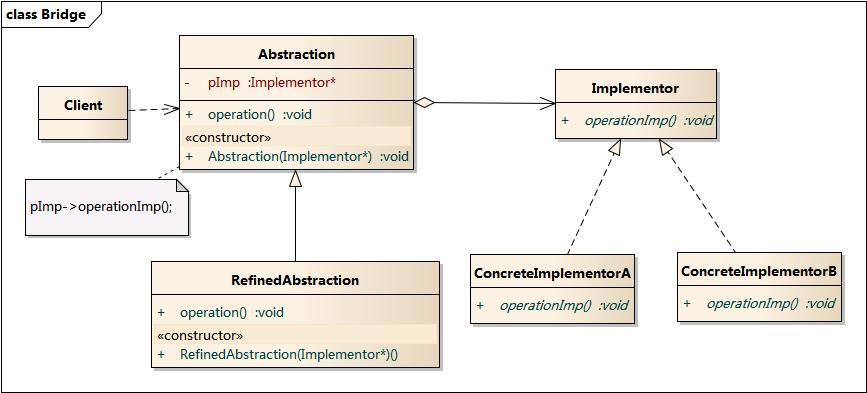
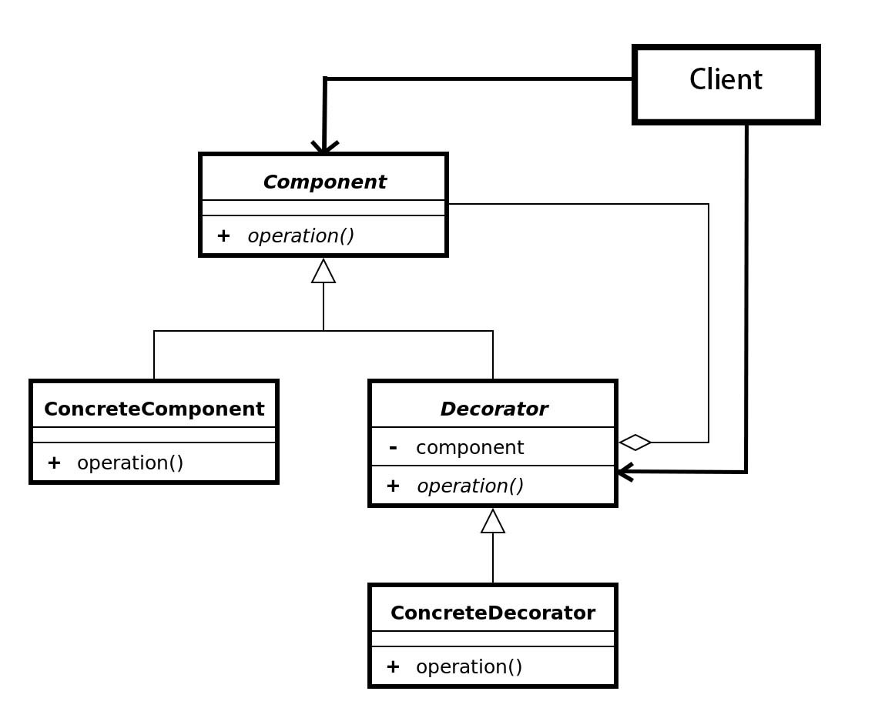

# 目录
<!-- vim-markdown-toc GFM -->

- [设计模式SOLID原则](#设计模式solid原则)
- [对象创建](#对象创建)
  - [简单工厂模式(Simple Factory)](#简单工厂模式simple-factory)
  - [原型模式(Prototype)](#原型模式prototype)
  - [工厂方法模式(Factory Method)](#工厂方法模式factory-method)
  - [抽象工厂模式(Abstract Factory)](#抽象工厂模式abstract-factory)
  - [建造者模式(Builer)](#建造者模式builer)
  - [桥接模式(Bridge)](#桥接模式bridge)
  - [单例模式(Singleton)](#单例模式singleton)
  - [享元模式(Flyweight)](#享元模式flyweight)
- [接口隔离](#接口隔离)
  - [表观模式(Facade)](#表观模式facade)
  - [中介者模式(Mediator)](#中介者模式mediator)
  - [适配器模式(Adapter)](#适配器模式adapter)
- [行为变化](#行为变化)
  - [代理器模式(Proxy)](#代理器模式proxy)
  - [装饰器模式(Decorator)](#装饰器模式decorator)
  - [访问者模式(Visitor)](#访问者模式visitor)
  - [状态模式(State)](#状态模式state)
  - [命令模式(Command)](#命令模式command)
- [组件协作](#组件协作)
  - [模板方法模式(Template Method)](#模板方法模式template-method)
  - [策略模式(Strategy)](#策略模式strategy)
  - [观察者模式(Observer)](#观察者模式observer)
  - [责任链模式(Chain of Responsibility)](#责任链模式chain-of-responsibility)
- [其他模式](#其他模式)
  - [组合模式(Composite)](#组合模式composite)
  - [解释器模式(Interpreter)](#解释器模式interpreter)
  - [备忘录模式(Memento)](#备忘录模式memento)

<!-- vim-markdown-toc -->

# 设计模式SOLID原则
* **单一职责原则(SRP)**：一个类应该仅有一个引起它变化的原因
* **开放关闭原则(OCP)**：类模块应该是可扩展的，但是不可修改
* **里氏替换原则(LSP)**：子类应该具有其父类的所有功能(is-a)
* **接口分离原则(ISP)**：类的接口粒度要足够细，避免客户依赖他们不用的方法
* **依赖倒置原则(DIP)**：高层模块与底层模块都应面向稳定的接口编程

# 对象创建
## 简单工厂模式(Simple Factory)

* 将对象的创建与使用分离，避免将具体类型硬编码到客户代码中，扩展时只需要修改一处创建代码
* 缺点：扩展产品需要修改静态工厂函数的源码

## 原型模式(Prototype)

* 将对象的创建与使用分离，避免将具体类型硬编码到客户代码中，扩展时只需要修改一处创建代码
* 缺点：具体类型暴露给用户从而无法保证客户代码的正确的使用原型

## 工厂方法模式(Factory Method)

* 将对象的创建与使用分离，避免将具体类型硬编码到客户代码中，扩展时只需要修改一处创建代码
* 缺点：会产生较多的类

## 抽象工厂模式(Abstract Factory)

* 将对象的创建与使用分离，避免将具体类型硬编码到客户代码中，扩展时只需要修改一处创建代码
* 统一创建同一产品族的多个对象
* 工厂方法模式实现：可以隐藏具体产品类
* 原型模式实现：动态配置工厂且减少类的创建

## 建造者模式(Builer)

* 面向Builder接口编程，分步构建复杂的对象

## 桥接模式(Bridge)

* 将抽象部分（业务功能）与实现部分（平台实现）分离，使它们独立变化
* 在C++中，对象属性（成员对象）存在与接口当中，利用桥接模式将其转移到实现当中

## 单例模式(Singleton)

* 对唯一实例的受控访问

## 享元模式(Flyweight)

* 将对象化分为内部状态与外部状态，内部状态由享元工厂产出，外部状态由客户代码提供

# 接口隔离
## 表观模式(Facade)

* 将相互耦合关系比较大的一系列组件封装起来简化接口

## 中介者模式(Mediator)

* 利用中介对象来隔离一系列对象的复杂交互，使各对象无需显示相互引用
    > C++中中介者持有shared_ptr，同事类持有weak_ptr

## 适配器模式(Adapter)

* 复用已存在的适配者类，利用适配器包装后用于给定的接口
* 优先选择类的组合，以下考虑类的继承：
    * 需要覆盖virtual函数实现
    * 需要访问protected成员
    * 需要空基类优化(EBO)

# 行为变化
## 代理器模式(Proxy)

* 通过代理对象去掉客户不能看到的内容或者添加客户需要的额外服务
* 常见的代理模式类型：
    * 远程代理：延迟加载
    * 虚拟代理：延迟创建
    * COW代理：写时复制
    * 保护代理：权限区分
    * 缓存代理：缓存操作结果用于共享
    * 同步代理：并发同步
    * 智能引用代理：引用计数

## 装饰器模式(Decorator)

* 一种代替继承、可动态扩展添加类的功能的技术
* 减少类的创建

## 访问者模式(Visitor)

* 适用于对象结构包含很多对象且有不同的接口，或者对象中包含很多不相关的操作
* 利用双分派技术使具体操作内容取决于visitor和element的类型
* 缺点：添加元素时需要修改所有visitor对象

## 状态模式(State)

* 内部状态改变时改变其行为

## 命令模式(Command)

* 将请求的调用与实现分离，从而可以实现：
    * 请求排队
    * 请求日志
    * 撤销与恢复(结合Memento)
    * 宏命令(结合Composite)

# 组件协作
## 模板方法模式(Template Method)

* 基类定义算法的骨架（各个步骤方法的默认实现），子类选择性覆盖之

## 策略模式(Strategy)

* 将算法独立出来可替换、复用

## 观察者模式(Observer)

* 定义对象间的多对一的依赖关系

## 责任链模式(Chain of Responsibility)

* 运行时赋予多个对象处理请求的机会（但最终只有一个负责处理），从而使请求的发送者与接收者解耦
* 可设计成混合类

# 其他模式
## 组合模式(Composite)

* 将对象组合成树形结构以表示“部分-整体”的层次结构，使得客户不用区分单个对象与组合对象

## 解释器模式(Interpreter)

* 只有满足“业务规则频繁变化，且类似的结构不断重复出现， 并且容易抽象为语法规则的问题”才适合使用Interpreter模式
* 通过利用组合模式与重载操作符，就相当与借用编译器的语法解析器

## 备忘录模式(Memento)

* 在外部存储内部状态以届时恢复

