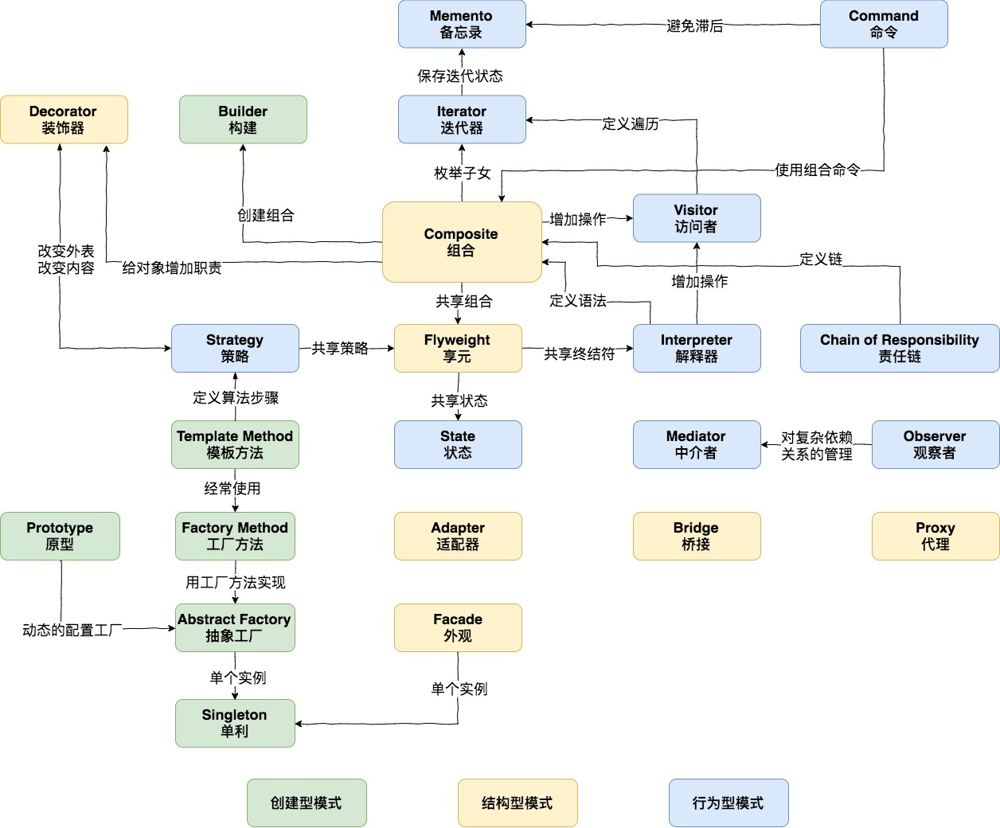
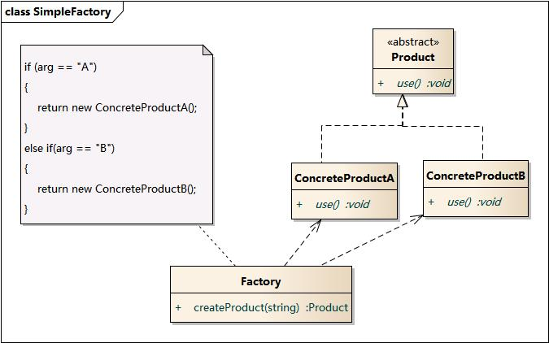

# 目录
<!-- vim-markdown-toc GFM -->

- [设计模式SOLID原则](#设计模式solid原则)
- [创建型模式](#创建型模式)
  - [简单工厂模式(Simple Factory)](#简单工厂模式simple-factory)
  - [工厂方法模式(Factory Method)](#工厂方法模式factory-method)
  - [原型模式(Prototype)](#原型模式prototype)
  - [抽象工厂模式(Abstract Factory)](#抽象工厂模式abstract-factory)
  - [单例模式(Singleton)](#单例模式singleton)
  - [建造者模式(Builer)](#建造者模式builer)
- [结构型模式](#结构型模式)
  - [享元模式(Flyweight)](#享元模式flyweight)
  - [桥接模式(Bridge)](#桥接模式bridge)
  - [适配器模式(Adapter)](#适配器模式adapter)
  - [代理模式(Proxy)](#代理模式proxy)
  - [装饰器模式(Decorator)](#装饰器模式decorator)
  - [组合模式(Composite)](#组合模式composite)
  - [外观模式(Facade)](#外观模式facade)
- [行为模式](#行为模式)
  - [责任链模式(Chain of Responsibility)](#责任链模式chain-of-responsibility)
  - [命令模式(Command)](#命令模式command)
  - [备忘录模式(Memento)](#备忘录模式memento)
  - [中介者模式(Mediator)](#中介者模式mediator)
  - [观察者模式(Observer)](#观察者模式observer)

<!-- vim-markdown-toc -->

# 设计模式SOLID原则
* **单一职责原则(SRP)**：类的功能要单一，利用接口将各个功能单一的类组合在一起，防止连带修改源码
* **开放关闭原则(OCP)**：当需要新功能时，不应该修改旧源码，而应该对其进行非侵入式的扩展
* **里氏替换原则(LSP)**：注意(public)继承的意义，不要破坏这份抽象
* **接口分离原则(ISP)**：类的接口粒度要足够细，可不用实现不必要的接口
* **依赖倒置原则(DIP)**：告诉我们要面向接口编程

# 创建型模式
## 简单工厂模式(Simple Factory)

* 将对象的创建与使用分离
* <u>可以</u>隐藏具体产品类
* 扩充产品需要修改静态工厂函数的源码

## 工厂方法模式(Factory Method)

* 将对象的创建与使用分离
* <u>可以</u>隐藏具体产品类

## 原型模式(Prototype)

* 将对象的创建与使用分离
* 减少类的创建

## 抽象工厂模式(Abstract Factory)

**特点**
* 将对象的创建与使用分离
* 统一创建同一产品族的对象
* 工厂方法模式实现：可以隐藏具体产品类
* 原型模式实现：动态配置工厂且减少类的创建

## 单例模式(Singleton)

* 对唯一实例的受控访问

## 建造者模式(Builer)

* 将对象的构建与装配分离

# 结构型模式
## 享元模式(Flyweight)

* 复用内部状态，外部状态由客户端给出

## 桥接模式(Bridge)

* 将接口与实现分离

## 适配器模式(Adapter)

* 将已存在的适配者类适配到给定的接口

## 代理模式(Proxy)

* 通过代理对象去掉客户不能看到的内容或者添加客户需要的额外服务

## 装饰器模式(Decorator)

* 动态地为产品添加一些操作
* 减少类的创建

## 组合模式(Composite)

* 将接口统一的对象组合成树形结构“组件-容器”的层次结构从而最后进行递归操作

## 外观模式(Facade)

* 将整个功能模式使用时需要用到的类封装到一个表观类中以简化使用

# 行为模式
## 责任链模式(Chain of Responsibility)

* 沿着一条链上的多个对象传递操作请求

## 命令模式(Command)

* 分离操作请求的发送与接收执行，以实现：
    * 请求排队
    * 请求日志
    * 撤销与恢复(Memento)
    * 宏命令(Composite)

## 备忘录模式(Memento)

* 在外部存储内部状态以届时恢复

## 中介者模式(Mediator)

* 利用中介对象来隔离一系列对象的复杂交互

## 观察者模式(Observer)

