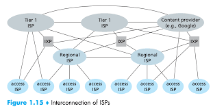

# 目录
<!-- vim-markdown-toc GFM -->

- [互联网结构](#互联网结构)
  - [ISP](#isp)
  - [接入网](#接入网)
- [协议分层](#协议分层)
  - [应用层](#应用层)
    - [DNS](#dns)
    - [DHCP](#dhcp)
    - [HTTP](#http)
    - [SMTP](#smtp)
    - [BitTorrent](#bittorrent)
  - [传输层](#传输层)
    - [TCP](#tcp)
      - [全双工连接](#全双工连接)
      - [可靠数据传输](#可靠数据传输)
      - [流量控制](#流量控制)
      - [拥塞控制](#拥塞控制)
    - [UDP](#udp)
  - [网络层](#网络层)
    - [数据平面](#数据平面)
    - [控制平面](#控制平面)
  - [链路层](#链路层)
  - [物理层](#物理层)
- [分组交换技术](#分组交换技术)
- [安全通讯](#安全通讯)
- [网络协议栈完整工作流程](#网络协议栈完整工作流程)

<!-- vim-markdown-toc -->

# 互联网结构
## ISP
<!-- 层次结构 -->



## 接入网
* 广域网接入
    * 拨号      （传统电话线）
    * DSL       （基于电话线）
    * 电缆      （基于电视线）
    * FTTH      （光纤）
    * 蜂窝网络  （陆地无线电）
    * 卫星      （卫星无线电）
* 局域网接入
    * 以太网
    * WiFi

# 协议分层
| OSI七层模型 | TCP/IP五层模型 |
|-------------|----------------|
| 应用层      | 应用层         |
| 表现层      | 应用层         |
| 会话层      | 应用层         |
| 传输层      | 传输层         |
| 网络层      | 网络层         |
| 链路层      | 链路层         |
| 物理层      | 物理层         |

## 应用层
### DNS
***UDP 53***
<!-- 层次结构 -->
**分布式层次数据库**
* Public
    * 根DNS
    * 顶级DNS
* Private
    * 权威DNS
    * 本地DNS

**DNS记录**
> `(Name, Value, Type ,TTL)`
* `(HostAlias, HostName, CNAME)`
    > 获取主机别名对应的规范主机名
* `(HostName, IP, A)`
    > 将规范主机名映射到一个IP
* `(DomainName, DNSHostName, NS)`
    > 获取某个域对应的权威DNS服务器的域名
* `(MailAlias, MailHostName, MX)`

**查询DNS记录**
* 递归查询与迭代查询
* DNS缓存
* 负载分配

**插入DNS记录**
* 向[注册登记机构](http://www.internic.net)申请
* 向所有对应的TLD插入DNS记录
* 若有多个IP主机则应该提供自己的DNS服务器，并设置别名

### DHCP
**UDP 67**
* DHCP发现：利用广播目的地址发现并请求DHCP主机

* DHCP响应：DHCP主机响应请求
    * 上述DHCP发现报文的事务ID
    * 向客户推荐的IP/Mask、DNS、GW
    * IP租用期

* DHCP请求：客户端选择接收一个DHCP响应并确认

* DHCP接收：服务端接收并确认客户端的确认

### HTTP
[http](http.md)

### SMTP
***TCP 25***

**特点**
* SMTP握手
* 持续连接
* ASCII7

**一般流程**
* 发送方发送报文给SMTP服务器
* SMTP服务器利用SMTP协议转发报文给接收方SMTP服务器（循环尝试，失败则发邮件提醒发送方）
* 接收方连接SMTP服务器接收报文，并存入接收方邮箱
* 接收方通过客户端与其SMTP服务器通讯获取邮件

**客户端与邮件服务器通讯协议**
* POP3
* IMAP
* HTTP

### BitTorrent
**特点**
* 文件分块
* 同时下载和上传文件块

**一般流程**
* 向追踪器注册自己
* 追踪器随机提供一个对等方子集
* 并行连接所有对等方子集
* 周期性向对等方询问其已有块列表
* 应该选择下载哪个块：最稀缺优先原则
* 响应哪些邻居请求：疏通
    > 疏通即4个最高带宽的对等方，每30秒随机选取新的试探对等方加入筛选

## 传输层
### TCP
#### 全双工连接
**三次握手**
1. `SYN->`       ：请求连接
2. `<-SYN ACK`   ：确认连接，接受连接
3. `ACK->`       ：确认接受连接

* 为什么需要三次握手：
    * 防止旧的重复连接的初始化
    * 同步双方的初始序列号
    * 避免资源浪费
* 只有第三次握手包能携带数据，因为此时双方都已确认对方具有建立连接的能力
* DOS泛洪攻击：发送大量合法的`SYN`包而无后续操作，导致占用服务器资源
    * 减少半连接状态持续时间
    * 设置最大半连接数
    * 攻击者IP黑名单
    * 过滤网关防护

**四次挥手**
1. `FIN->`       ：结束连接
2. `<-ACK`       ：确认结束连接
3. `<-FIN`       ：结束连接
4. `ACK->`       ：确认结束连接

* 为什么四次挥手：因为是全双工连接，关闭一个方向的连接需要一次请求与一次应答
* 在发起关闭连接的一方（即调用close()函数的一方）在四次挥手（即回传ACK）之后，进入TIMEWAIT状态，原因有二：
    * 确认对等方接受到了回传的ACK包，若其未接受到则会再次发起一个FIN请求包给本机。
    * 等待时间持续2MSL（即2倍的报文最长生存时间），意义是在完全断开连接启动下次连接之前，
    让还在网络中传输的、属于该次会话的TCP报文全部过期失效
* TIME_WAIT过多
    * 内存资源占用
    * 端口的占用

**流式数据导致粘包**：
* 接受方：不及时处理
* 发送放：等待缓冲区满
* 解决：
    * TCP紧急传送指令，不等待缓冲区满
    * 后台线程预处理

#### 可靠数据传输
**定时器的超时间隔计算**
> 指数加权移动平均（EWMA）
* SampleRTT均值：$EstimatedRTT = (1 - \alpha) \times EstimatedRTT + \alpha \times SampleRTT$
    > 推荐$\alpha = 0.125$。仅在某时刻测量SampleRTT而非对每个报文都测量，且不会为重传的报文测量
* SampleRTT偏离程度：$DevRTT = (1 - \beta) \times DevRTT + \beta \times |SampleRTT - EstimatedRTT|$
    > 推荐$\beta = 0.25$
* 超时间隔：$TimeoutInterval = EstimatedRTT + 4 \times DevRTT$
    > 推荐$初始TimeoutInterval = 1s$，每次超时时会将TimeoutInterval加倍
>

**发送方的简化状态机模型**
```python
if 从应用层接收到数据:   # 事件一
    if 未启动定时器:
        则启动定时器
    将数据分片封装
    记录下个数据段的起始序号

if 接受到ACK报文:       # 事件二
    if ACK报文的序号 > 最早的未被确认的已发送数据段的序号:
        更新最早的未被确认的已发送数据段的序号
        if 所有已发送数据段均已被确认:
            重启定时器
    elif 如果接受到3次冗余ACK:
        立即回传冗余ACK期望的数据段

if 定时器超时:          # 事件三
    超时间隔 *= 2
    重启定时器
```


**接收方的状态机模型**
```python
if 接受到期望序号报文且之前数据均已确认:
    延迟回传ACK，最多延迟500 ms

elif 接受到期望序号报文且另一个报文等待确认:
    立即回传ACK累积确认两个报文

elif 接受到可以填充数据缺失间隙的报文:
    立即回传ACK累积确认

elif 比期望序号大的报文到达（数据缺失）:
    立即回传ACK指定期望序号

elif 比期望序号小的报文到达（数据冗余）:
    丢弃数据

elif 校验报文数据损坏且无法修复:
    丢弃数据
```

#### 流量控制


* 目的：保护接受方的缓存不溢出

* 手段：计算已发送但未确认的数据段总大小，其长度不能超过对等方接收窗口大小

* 注意：当接收窗口大新为0时，仍需持续发送1字节数据的数据段，直到接收窗口空闲

#### 拥塞控制
**结合流量控制与拥塞控制机制，需要保证已发送且未被确认的数据长度必须小于对等方接受窗口大小以及本地拥塞窗口大小**
> 拥塞窗口大小为cwnd  
> 慢启动阀值为ssthresh  
> 最大分段大小为MSS = MTU - IP报头 - TCP报头

* 初始状态：设置拥塞窗口大小为1×MSS，进入慢启动模式
* 慢启动模式：
    * 每当接受到一个新ACK，则`cwnd += 1×MSS`
    * 当拥塞窗口达到慢启动阀值后，进入拥塞避免模式
    * 当接受到3次冗余ACK后，则`ssthresh = cwnd/2`，`cwnd = ssthresh + 3×MSS`，并进入快速恢复模式
    * 当定时器超时后，则`ssthresh = cwnd/2`，`cwnd = 1×MSS`，并重入慢启动模式
* 拥塞避免模式：
    * 每当接受到一个新ACK，则`cwnd += (MSS/cwnd)×MSS`
    * 当接受到3次冗余ACK后，则`ssthresh = cwnd/2`，`cwnd = ssthresh + 3×MSS`，并进入快速恢复模式
    * 当定时器超时后，则`ssthresh = cwnd/2`，`cwnd = 1×MSS`，并进入慢启动模式
* 快速恢复模式：
    * 当接受到一个新ACK，则`cwnd = ssthresh`，并进入拥塞避免模式
    * 每当接受到一个冗余ACK，则`cwnd += 1×MSS`
    * 当定时器超时后，则`ssthresh = cwnd/2`，`cwnd = 1×MSS`，并进入慢启动模式

### UDP
* 不保证数据不缺失
* 不保证数据不冗余
* 校验但不恢复差错

## 网络层
### 数据平面
* 利用CIDR（无类别域间路由选择）将传统分类编址的IP地址的分类一般化：`IP/Mask`

* **主机** 根据路由表选择下一条地址

* **网关** 接收子网主机的数据包并进行转发，可能会利用到NAT与UPnP

* 网络核心中的 **路由器** 根据路由表选择下一条地址，直到交付成功、丢包、TTL为0

* 防火墙机制


* Linux路由表：用户可自定义1-252号路由表，内核维护如下4个路由表

| 表号 | 名称    | 说明                 |
|------|---------|----------------------|
| 0    | system  | 系统保留             |
| 253  | default | 没特别指定的默认路由 |
| 254  | main    | 没指定表号的所有路由 |
| 255  | local   | 保存本地接口地址     |

**路由表包含信息**
* 目的主机/网段：指定适用的目的IP
* 网关：是否需要网关以及网关的IP
* 设备：用哪个网卡发送数据包（同时也指定了本地源IP）
* 附加信息：如目标是否可达、协议头部参数、路由作用域等等
    > 路由作用域(scope)：
    > * host：指定该条路由只用于本机内部通信
    > * link：指定该条路由仅用于局域网通信
    > * global：指定该条路由可用于全局通信

* 代理与VPN的区别

| 异同           | 代理                       | VPN                                                    |
|----------------|----------------------------|--------------------------------------------------------|
| 是否隐藏本地IP | 是                         | 是                                                     |
| 是否加密       | 默认否                     | 是                                                     |
| 主要协议       | HTTP(应用层)、SOCK(应用层) | PPTP(链路层)、L2TP(链路层)、IPSec(网络层)、SSL(应用层) |

### 控制平面
<!-- 层次结构 -->
* **AS（自治系统）内部的路由选择：OSPF（开放最短路优先）**  
利用OSPF报文，AS内部路由器进行周期性广播通报，从而使每台路由器维护整个AS拓扑图（邻接表），
从而通过Dijkstra算法求得最短路由

* **ISP之间的路由选择：BGP（边界网关协议）**  
AS之间使用BGP报文来互相通告每个AS中含有的子网信息，并最终扩散到整个互联网

## 链路层
* 成帧：MTU
* 链路接入：MAC
    > 为何不用IP代替MAC
    > * 保证独立性
    > * 避免移动时重新配置IP
    > * 避免主机频繁被无关帧中断
* 数据有效

**WiFi：**
* 扫描：被动扫描与主动扫描信道以发现AP
* 鉴别：通过身份验证
* 关联：无线主机在AP注册成功，并获取临时密钥进行链路层加密
> **注意：一般无线网卡无法抓取MAC地址非本机的包（即使开启混杂模式）** 

**交换机：**
* 作用
    * 消除碰撞
    * 异质链路
    * 网络管理
    * 自学习
* 转发原理
    * 情况一：无对应MAC地址的表项
        > 泛洪
    * 情况二：存在对应表项，且来源端口与表项中绑定的端口相同
        > 过滤
    * 情况三：存在对应表项，且来源端口不与表项中绑定的端口相同
        > 转发

## 物理层

* 双绞铜线      ：最便宜且最常用、电话机、高速LAN主导性方案
* 同轴电缆      ：电缆电视系统、共享媒体
* 光纤          ：稳定安全、高成本光设备、海底光缆
* 陆地无线电信道：穿墙、移动用户、长距离
* 卫星无线电信道：同步卫星、近地轨道卫星

# 分组交换技术
**时延：**
> 分类
* 处理时延（验证、路由等计算）
* 排队时延（按队列接收并转发数据）
* 传输时延（存储转发）
* 传播时延（信号亚光速传播）

**带宽：**
> 影响因素
* 网络设备
* 端设备
* 拓扑结构
* 数据类型
* 用户数量

# 安全通讯
* 机密性
* 完整性
* 端点鉴别
* 运行安全性

# 网络协议栈完整工作流程
* **发送**
    1. **应用层**调用socket接口，请求发送message
        > 申请socket、指定协议族、绑定本地网卡IP与端口号、发指定对等方IP与端口号、送与接受数据
    2. **传输层**确认参数（传输层协议、目的端口号、本地端口号等），将数据分片并封装为segment
        > 传输层如TCP协议还负责一些额外功能
    3. **网络层**确认参数（网络层协议、目的IP等），并查询路由表确认参数（下一跳IP与本地IP），并封装为datagram
        > 通过路由表选择下一跳地址（或无法到达、或直接发送、或通过网关），
        > 以及从哪个本地网络接口设备发送数据，
    4. **链路层**利用ARP表确认参数（链路层协议、目的MAC、本地MAC等），并封装成frame
        > 若发现目的IP与网卡IP/广播/多播地址相同，则将其上传至网络层（**接受**流程第3步）
        > 若ARP表中不存在目的IP的MAC地址，则发送ARP请求
    5. **物理层**中物理网卡将信息转换为网线信号，封装成物理帧

* 接收：
    1. **物理层**中物理网卡将网线信号转换为主机总线信号，并检查frame的目的MAC地址是否与本机匹配
        > 若开启网卡混杂模式，则即使目的MAC地址不匹配也会上传至链路层
    2. **链路层**处理ARP请求
    3. **网络层**进行路由判断，并检查目标网卡是否存在应用监听再决定是否上传数据
        > 还可以处理ICMP包
    4. **传输层**检查目的协议的端口是否开启（存在应用监听）
    5. **应用层**数据包回传给应用程序

* 虚拟网卡：在网络层根据路由表即返回
* 虚拟网桥：相当于转发路由器
* 虚拟网关：利用NAT进行转发

<!--
TCP：
    变量：seq, ack, TimeoutInterval
    事件：冗余ack, 异常超时
    动作：单段重传, 累计确认
    状态：慢启动, 拥塞避免, 快速重传
-->
