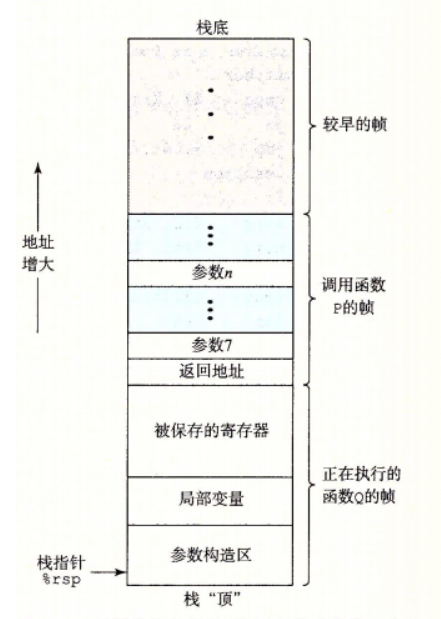
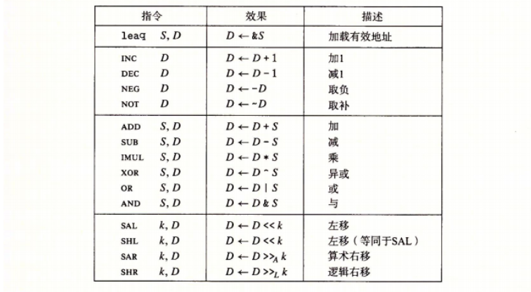
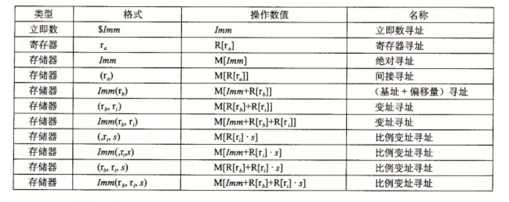
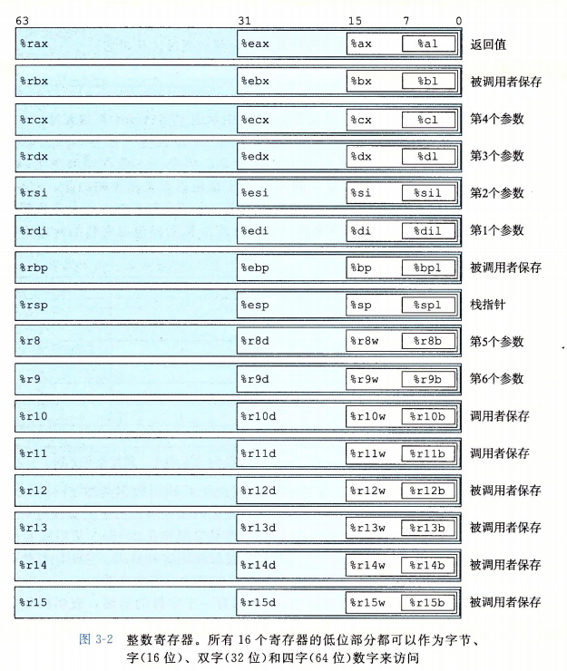
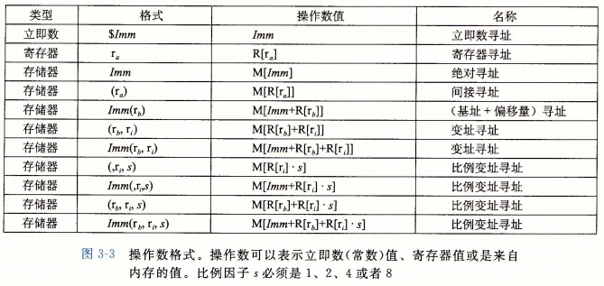
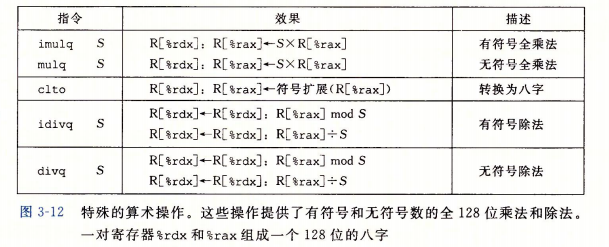
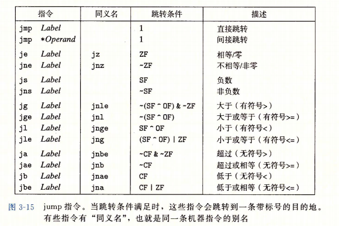
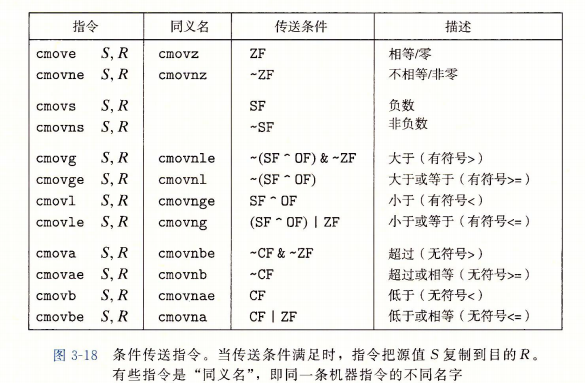
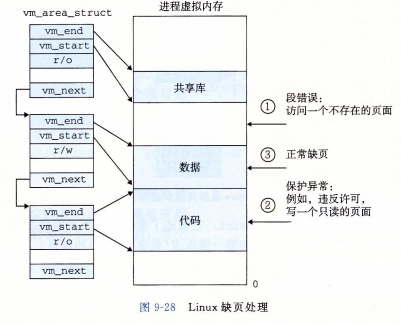

该笔记是原本的精简版，隐去了太过底层的细节  
[笔记原本](http://note.youdao.com/noteshare?id=8e8bc1bd1b6105cd97dc35e694eddc9d)放在有道云上了，
没转移，又臭又长。。。  

**NOTE**!!!!!: 笔记里插入有$L^AT_EX$公式(github不支持)，

调用api的话如果在公式里用中文，还得用浏览器转移URL

所以各位记得给你的chrome安个[插件](https://github.com/orsharir/github-mathjax/issues/24#issuecomment-438140315)，
该插件若从chrome商店安装的话要出问题，记得clone下来手动安装，链接里的issue提到了

# 目录

<!-- vim-markdown-toc GFM -->

- [数位表示](#数位表示)
  - [整数](#整数)
  - [整数操作](#整数操作)
  - [浮点数](#浮点数)
- [机器代码](#机器代码)
  - [汇编代码格式](#汇编代码格式)
  - [机器指令](#机器指令)
  - [C语句的翻译](#c语句的翻译)
  - [结构对齐](#结构对齐)
  - [运行时栈](#运行时栈)
- [处理器结构](#处理器结构)
  - [现代处理器](#现代处理器)
- [性能优化](#性能优化)
- [硬件组成](#硬件组成)
- [链接](#链接)
- [操作系统](#操作系统)
  - [异常控制流](#异常控制流)
  - [虚拟内存](#虚拟内存)
  - [系统I/O](#系统io)
  - [并发编程](#并发编程)
  - [处理器机制](#处理器机制)
- [系统结构](#系统结构)
  - [硬件组成](#硬件组成-1)
  - [操作系统](#操作系统-1)

<!-- vim-markdown-toc -->
# 数位表示
## 整数
* 进制的转换
    * 2, 8, 16进制之间的转换：查表即可
        > 记下来当然更好
    * 十进制与其他进制的转换：计算器算呗
>

* 字长
    * 指明的指针的标称大小，也就决定了虚拟地址空间的大小
        > 32位大概4GB，64位大概16EB（如今只使用了48位作地址）
>

* 字节顺序
    * 小端：低位在低地址，高位在高地址
        > 大端相反，一般为小端
    * 逆向二进制文件时，一般是一字节一字节地转换
        > 故一个4字节的int被划分为一个一个的字节，它的高位部分其实是在右边的，
        > 而不是我们一般习惯的左边开头  
        > 例如：利用xxd工具，读出一个short int为`00 01`，代表16进制数值为0x0100
>

* 整数表示
    * 无符型整数：无符型编码 **U**
        
    * 有符型整数：补码编码 **T**
        > 注意补码正负范围不对称，|Tmin| = |Tmax| + 1

        
>

## 整数操作  
**限制从不受信任的源接收数据的数量和格式！**
* 截断
    > 截断后值域改变从而导致数值可能变化，与**T**相关的截断甚至可能改变符号
* 扩展
    * 对**T**来说应该**符号扩展**
    * 对**U**来说应该**零扩展**
* 相互转换
    > 保持底层位模式不变，若长度不同，则先截断或扩展，再重新解释位模式
    * T => U：  
        
    * U => T：  
        
* 加法运算
    > 完全相同的位级运算
    * **U**加法  
        
    * **T**加法  
        
* 乘法运算
    > 不完全相同的位级运算，但是截断后的结果相同
    * **U**乘法  
        
    * **T**乘法  
        
* 求反运算
    * **T**求反  
        
    * **U**求反  
        
* 常数乘除
    > 可以利用位移运算优化，一般由编译器做展开而不手动优化以致降低可读性
* 溢出检测
    * **T**：
        * 正负符号错误
    * **U**：
        * 加(减)法  ：结果比两个操作数都要小(大)
        * 乘法      ：`!x || z / x == y`为`true`则`z = x * y`未溢出
* 位运算技巧
    * 向上舍入  ：`(x + y - 1) / y`
    * 取模      ：截断数位、限制大小、循环往复
    * 位移      ：`-1 << n == pow(-2, n)`
    * 位反      ：`~x == -x - 1`
    * 位与      ：0归零，1取值
    * 位或      ：0不变，1存值
    * 位异或    ：0不变，1取反，同归零
    * 最值      ：
        * `INT32_MAX`为`214...`共10位
        * `INT64_MAX`为`922...`共19位

## 浮点数
* IEEE浮点表示  

* $浮点数=尾数\times2^{阶码}$
    > 类似二进制的科学计数法
* 阶码
    > 规格化数  ：$exp - (2^{k-1} - 1)$  
    > 非规格化数：$1 - (2^{k-1} - 1)$  
    > 目的是：1. 由规格化数平滑过渡到非规格化数；2. 可以用整数比较的硬件来比较浮点数
* 尾数
    > 规格化数  ：$frac$ 为小数部分，整数部分为$1$  
    > 非规格化数：$frac$ 为小数部分，整数部分为$0$
* 注意：
    * 浮点数不具备**结合律**且其*加法*不具备**分配律**
        > 因为**精度丢失**与**无穷溢出**
    * 浮点数**加法**具有单调性
        > 若$a\geq b$且$c \neq NAN$，则$a+c\geq b+c$  
        > 而整数因为溢出会导致数值回环，浮点溢出时符号不变而只是变为了无穷值
    * 精度丢失问题
        * 随着浮点数的阶码愈来愈大，其精度也愈来愈差，当大于某个值时，浮点数的精度会大于$1$，
            这也就意味着此时浮点数可能无法准确表示大于该值的整数了
        * 记住：**int大于$2^{24}$(或long大于$2^{53}$)时float(或double)便可能无法准确表示一个整数了**
            > float的尾数有23，当阶码值等于23时，小数点在尾数的最后一位二进制数的后面，
            > 此时精度即为$2^0=1$，阶码值再大则精度便会大于1了
        * 记住：**float的十进制有效位数是6，double是15**
            > 一个十进制数字需要用$log_{2}10$位的二进制来表示，那一个二进制位可以表示$\frac{1}{log_{2}10}$
            > 个十进位。对float来说即23位尾数可以表示的十进制数字的位数是$\frac{23}{log_{2}10}\approx6.92$，
            > 即6位十进制数是可以保证正确的，第七位的话是部分正确的，
            > 意思是23位的二进制数的能表示的最大值是8388608，第七位是无法表示`9`的，或者第七位表示`9`时，其它低位又不足以表示完整数值
* 浮点数与**T**的转换： 丢弃小数部分

# 机器代码
## 汇编代码格式
以ATT格式的汇编代码为例
* 以`.`开头的行是用于指导汇编器和链接器工作的伪指令
* 以`:`结束的行是用于标记跳转的地址
* 数据类型
    > ATT格式要求指令尾缀加上数据类型

    
* 寄存器
    > 其中可由当前函数随意调用的通用寄存器共有9个
    * 被调用者保存寄存器：即该寄存器属于上级函数，当前函数(**被调用者**)试图占用该寄存器前，
        负责保存里面的值并在函数返回前恢复
    * 调用者寄保存存器：即该寄存器可以被当前函数(**调用者**)随意使用，但在调用其他函数前需要保存里面的值，
        因为对下级函数来说，该寄存器也可以随意调用而不会保存里面的值
    
* 操作数
    > 大多数指令有一个或多个操作数，用以指出该指令需要使用的源数据值，
    > 以及放置结果的目的位置(右操作数)。
    * 立即数
    * 寄存器
    * 内存引用  

## 机器指令
* 数据传送(mov)
    > 赋值运算符、整型转换
* 压栈与弹出(push, pop)
    > 存取栈上(内存)的数据
* 调用与返回(call, ret)
    > call相当于push %rip; jump func  
    > 即将PC压栈后跳转到制定函数
* 算术与逻辑操作  

* 特殊算术操作  

* 测试指令
    > 根据条件码进行测试操作  
    > CMP $S_{1}, S_{2}$ &emsp;基于 $S_{2}-S_{1}$  
    > TEST $S_{1}, S_{2}$&emsp;基于 $S_{1}\&S_{s}$
    * 常用条件码
        
* 跳转指令  
    
* 条件赋值
    > 条件表达式

>

## C语句的翻译
* 分支语句
    * 利用<u>测试指令</u>与<u>跳转指令</u>进行条件检测并跳转
    * 因为会CPU破坏流水线的并行性，而CPU会进行分支预测，分支预测失败会丢弃预测之后的所有操作，
        所浪费的时间称之为分支预测处罚，尽量让更可能被执行的分支放在第一条
* 循环语句
    * do-while
        > 最基本的循环，使用分支语句跳转到之前的循环体开始处即可
    * jump-to-middle
        > 使用<u>无条件跳转指令</u>直接跳转到do-while的循环结构尾部的条件检测
    * guarded-do
        > 在进入循环前就进行一次条件检测以确认是否进入do-while结构
* switch语句
    * 通过跳转表的形式进行分支跳转
    * 跳转表：
        * 存储各个分支开始的地址
        * case标签值作下标索引，不存在的对应**case**标签的下标处存储的值是**default**标签的地址
            > 这也是为何要求case标签的值是整型字面值类型，而switch标签值也得是整型
        * switch标签转换为case标签，然后在作为跳转表的下标搜寻将要跳转的地址
            > 转换的意思是，当case标签值中的最小值太大时，会将所有的值加上一个偏移量使最小值为1，
            > 故switch标签也需要加上相同的偏移量
>

## 结构对齐
* 结构的地址对齐与其成员中的对齐最大的
* 数组的地址对齐即元素的对齐
* 大多数的栈帧边界是16字节地址对齐

</img>
## 运行时栈
左图，从高地址向低地址生长
* 参数构造
    * 用传值参数传递结构
    * 参数过多寄存器无法全部容纳

* 返回地址
    * 存放返回到上级函数执行代码的地址

* 保存寄存器
    > 上面 [寄存器](#register)中提到的需要保存寄存器  
    > 何时需要：
    * 可随意调用的寄存器已使用完
    * 需要基指针
    * 调用其它函数时保存现场

* 局部变量
    > 何时将值存储到栈上
    * 构造数组与结构
    * 寄存器不足
    * 对一个值取地址

# 处理器结构
* 指令集架构：一个处理器支持的指令和指令的字节级编码称为它的*指令集体系结构(ISA)*
    > 指令集架构所提供的抽象模型将软件设计与硬件设计分割开来
* 硬件描述语言：用文本的形式描述硬件结构
    > 早期的硬件设计是画图，现在是用*硬件描述语言(HDL)*，类似编程，但其描述的是结构而非过程
* 逻辑门：底层电路的设计模型，通过电路的串联、并联、二极管设计出基础的与、或、非三门，
    在由此构造九大门，再复合而成各种控制器与运算器
* 数字系统：
    * 组合逻辑：并不存储值，只输出状态（逻辑流）
    * 存储单元：时钟寄存器和随机访问存储器
    * 时钟信号：控制流水线各阶段的运算同步
>

* SEQ结构
    * 取指
    * 译码
    * 执行
    * 访存
    * 写回
    * 更新PC
>

## 现代处理器

* 超标量：一个周期多个操作，乱序执行
* ICU结构：
    * 取指单元
    * 译码单元：取出寄存器值并将指令分解为**微操作**
    * 退役单元：每个指令在此挂号，解决数据冒险以及避免控制冒险中预测错误时指令更改程序级状态
* EU结构：
    * 数据总线
    * 存储单元：对写内存的操作会首先在此挂号地址，数据可以稍后，解决数据冒险
    * 加载单元
    * 分支单元
    * 算术单元
* EU性能评定：
    * 延迟：操作完成所需周期数
    * 发射时间：吞吐量(IPC)的倒数
    * 容量：可用于该操作的单元数
    * CPE：每处理一个元素的周期数
    * 延迟界限：某操作所需的最小周期
    * 吞吐量界限：流水线加上指令级并行所需最小周期
* CPE并发性能计算
    * 流水线  ：$\frac{I\times n + L}{n}，当n远大于L时为I$

    * 指令并行：$\frac{L}{C}$
    * 两者结合：$I / C$，不过会受限于加载单元
>

# 性能优化
* 妨碍优化的因素
    * 内存别名引用
    * 函数调用副作用
* 性能优化
    * 减少函数调用
    * 减少内存引用
    * 寄存器值复用
        > 将寄存器的值写回内存时，注意后面是否还需要该值
    * 循环展开和积累多值
        > 降低循环次数，减少推进循环所做的额外工作  
        > 增加流水线并行效率，并利用了指令级并行  
        > 简单的循环计算可用**SIMD**代替循环展开
    * 重新结合
        > 减少循环片段，增加不同循环间的并发  
        > 循环片段：这次循环处理的数据，下次又要读  
        > 关键路径：先确定循环变量
    * 存储性能问题
        > 减少循环间WR数据相关性，特别是内存读写  
        > 例：这次循环写i+1，下次又要读i (即上次的i+1)
    * 分支预测问题
        > 更可能的分支放在第一位  
        > 可通过条件运算符来使用条件传送指令
    * 缓存性能问题
        > 降低内循环的步长，降低不命中率（可以牺牲外循环步长）
>

* 程序局部性
    * 时间局部性：将来会重复读写目标
    * 空间局性部：将来会目标附近的数据
    * 利用两者最大化数据缓存的效率
>

# 硬件组成

* CPU
    * 执行来自主存中的指令
    * 通过I/O桥与主存、显卡、I/O总线相连
        > 原来所说的北桥现在被集成进了CPU
* 主存
    * 临时存储设备，用来存放进程和进程处理的数据
* 显卡
    * 对图形计算更加高效的处理器
    * 集成显卡直接与显示屏相连
* 总线
    * 贯穿整个系统的电子管道，它负责在各个不见间传递信息
        > 功能：控制总线、地址总线、数据总线  
        > 位置：系统总线、内存总线、I/O总线
    * 总线传送定长的字节块，称为字
        > 现在大多为4字节(32位)或8字节(64位)
* I/O设备
    * 系统与外界相连的通道
        > 一般在南桥之后，也称作外设，例如：、键盘、鼠标、硬盘、网卡、声卡等
    * 它们通过**控制器**或**适配器**与总线相连
        > 控制器与适配器的区别在于封装方式不同：  
        > * 控制器：指I/O设备本身或者主板上的芯片组
        > * 适配器：插在主板插槽上的卡
>

* 存储技术
    * 随机访问存储器
        * SRAM：通电就可一直保持稳定状态
        * DRAM：需要周期性地刷新内存每一位
        * FPM DRAM：快页模式
        * EDO DRAM：扩展数据输出
        * SDRAM：同步
        * DDR SDRAM：双倍数据速率同步
        * VRAM：视频
        * 传统DRAM结构：
            * 芯片单元：超单元矩形阵列，内部行缓冲
            * 内存模块：多个模块连接到内存控制器，每个保存内存地址的一个字节
    * 非易失性存储器
        > 固件：存储在ROM中的程序
        * PROM：可编程，只能高电流熔断熔丝一次
        * EPROM：可擦写可编程，通过紫外光擦写
        * EEPROM：电子可擦除，Flash
    * 本地存储
        * 旋转磁盘(HDD)
            * 组成：扇区，盘面，柱面，磁道
            * 参数：转速，T seek，扇区数/磁道，扇区大小
            * 访问：寻道，旋转，传送
        * 固态硬盘(SSD)
            * 结构：闪存翻译层，块，页
            * 特点：页为单位读写，写前需要擦除块

# 链接
* 静态链接：
    * 静态库：依赖库放在后面且可重复
    * 符号解析：将引用与定义联系起来
    * 重定位：将多文件的各节聚合后，重定位地址引用
    * PIC：利用GOT和PLT实现位置无关代码以备动态共享
    * 链接错误：
        * 未定义的库或错误的路径
        * 多次定义同一符号
        * 多个文件引用的同名且未定义的全局变量为同一个，可能导致运行时逻辑错误
        * 引用和定义的符号的语言级类型不同
>

* 库打桩机制：
    * 编译时：  
        > 利用宏将`func`替换为你的`wrap_func`
    * 链接时
        > 利用参数`-Wl,--wrap,func`，链接时将`func`链接到`__wrap_func`，将`__real_func`链接到`func`
    * 运行时
        > 修改环境变量`LD_PRELOAD`，如此，程序寻找动态库时会先搜索`LD_PRELOAD`中的模块
>

* 加载与动态链接：
    * shell先frok出子进程，与父进程共享内存 (**写时复制**)
    * 再execv子进程清除并重新映射数据段 (**按需加载**)
    * 开始执行前先调用动态链接器加载目标共享库
    * 映射共享库并创建数据段副本
    * 绑定数据引用，过程引用延迟绑定
    * 进入系统启动函数，再调用main

# 操作系统
## 异常控制流
* 异常处理表
* 进程运行在上下文中，随时可能被操作系统调度
* 陷入系统调用可能发生：返回错误、信号中断
* 信号处理中断会随时发生，处理完成后返回主程序
* 进程组：命令行语句(用管道连接)，父子进程
* 信号处理技巧：
    * 阻塞信号并一次处理尽可能多的信号
    * 原子性操作
    * 调用异步信号安全函数
* 非本地跳转：只回滚寄存器中的值
>

## 虚拟内存
  
</img>
* 将进程使用的看似连续虚拟内存映射到主存和磁盘的各处
* 页&emsp;&emsp;：翻译、缓存和内存分配的基本单元
* 页表&emsp;：MMU将虚拟地址通过页表翻译为物理地址
* 段&emsp;&emsp;：将一组连续的相关联的虚拟页组织起来
* 段表&emsp;：用于判断并解决段错误、正常缺页、写时复制、按需加载、共享对象
* 内核保留虚拟内存：
    * 内核代码、数据
    * 物理内存映射
    * 其他硬件的寄存器映射
    * 进程信息
* 堆分配：
    * 堆块边界
    * 头部与脚部
    * 类大小空闲块链表数组
* 内存问题：
    * 正常缺页：页表未加载
    * 段错误：引用未分配虚拟内存
    * 保护异常：读/写/执无权限的段
    * 逻辑错误：修改了合法但错误的内存导致覆盖(元)数据
>

## 系统I/O
* 文件：磁盘、终端、网络
* 访问文件需要：
    * fd-table：进程独有，fork时子进程会继承此项
    * file-table：所有进程共享，包含了读写位置
    * v-node：系统唯一，记录文件的系统中的位置
* 访问文件：
    * 通过fd进行文件读写
    * 内存映射
* 不足值：EOF、命令行、socket、pipe
* IOStream的实现：fd、缓冲区(ptr, cnt)
* I/O重定向
>

## 并发编程
* 进程并发：开销大，IPC不便
* 线程并发：利用多核
* 并发问题：
    * 数据竞争、数据销毁：信号量互斥锁
    * 死锁：同序加锁并逆序解锁
* 同步：逻辑流顺序线性执行  
* 异步：逻辑流同时并行执行

## 处理器机制
* 流水线
* 指令并行
* 多核与超线程
* 多核数据同步
* 寄存器文件
* 高速缓存
* 中断与异常
* 内核模式与用户模式
* MMU翻译虚拟内存
* 外设I/O

* * * * * * * * * *

该书配套的实验，重装的时候忘保存了。。靠👀️  
github上由很多值得参考的仓库，不过还是要自己做啦，不能就让我自己受折磨呀🙈️

# 系统结构
## 硬件组成
* 电源
* 主板（包括固件、时钟）
* CPU（包括I/O桥）
* 内存
* 显卡与显示屏
* 总线
* 南桥芯片

* 外设：键盘、鼠标、硬盘、网卡、声卡等

## 操作系统
* **本地化配置**
    * 日期时间与时区（timedatectl）

    * 语系与字符集（localectl）
    * 主机名称（hostnamectl）
    * 字体（fontconfig）
* **系统日志**
    * 主机运行记录
    * 用户登录记录

    * 进程服务日志
    * 系统管理日志
    * 内核处理日志
* **网络管理**
    * 应用层：socket接口
    * 传输层：socket类型与端口号

    * 网络层：协议族类型、IP地址与子网掩码、路由表
    * 链路层：混杂模式、MAC地址、ARP表
    * 防火墙机制
* **虚拟文件系统**
    * 标准输入输出
    * 本地文件系统
    * 网络文件系统

    * 硬件设备文件
    * 内核接口文件
* **资源管理**
    * CPU使用
    * 内存使用
    * 磁盘I/O

    * 网络I/O
* **进程管理**
    * 自动化启动、重启、终止进程

    * 加载与链接
    * 进程状态：运行、睡眠、暂停、僵尸、终止
    * 进程上下文切换
    * 进程优先级
    * 进程间通讯
        > signal, pipe, socket, dbus
* **虚拟内存**
    * 内存映射（页）
    * 共享内存（段）

    * 内存分布
        * 内核保留
        * 物理内存映射
        * 硬件寄存器映射
        * 进程内存映射
            * 栈
            * 共享段
            * 堆
            * 数据段
            * 代码段
* **进程模型**
    * 环境变量
        > uid, euid, gid, egid  
        > pid, ppid, pgid, psid, tpgid,  
        > 等等
    * 进程参数
    * 线程管理
        * 上下文切换
        * 多线程同步

