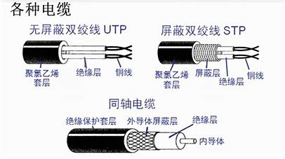
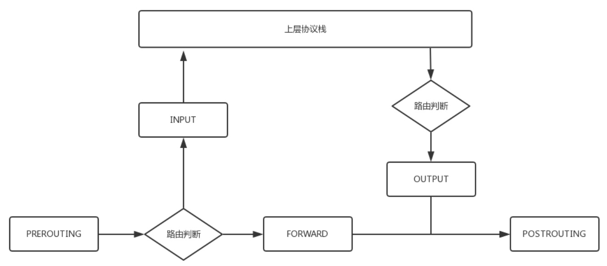

# 互联网结构
## ISP

## 接入网
* 广域网
    * DSL （基于电话线）
    * 电缆（基于电视线）
    * FTTH（光纤）
    * 拨号（传统电话线）
    * 卫星（卫星无线电）
    * 蜂窝网络
* 局域网
    * 以太网
    * WiFi

## 物理媒体

* 双绞铜线      ：最便宜且最常用、电话机、高速LAN主导性方案
* 同轴电缆      ：电缆电视系统、共享媒体
* 光纤          ：稳定安全、高成本光设备、海底光缆
* 陆地无线电信道：穿墙、移动用户、长距离
* 卫星无线电信道：同步卫星、近地轨道卫星

## 分组交换技术
message分片封装为packet，经switch/router转发或路由

**时延：**  
* 处理时延（验证、路由等计算）
* 排队时延（按队列接收并转发数据）
* 传输时延（存储转发）
* 传播时延（信号亚光速传播）

**带宽：**  
带宽（吞吐量）的大小主要由防火墙内网卡，及程序算法的效率决定，尤其是程序算法，
会使防火墙系统进行大量运算，通信量大打折扣。

# 协议分层
* 物理层
* 链路层
* 网络层
* 传输层
* 应用层

## 应用层
### DNS: UDP 53
* 查询
    * 递归查询与迭代查询
    * DNS缓存

* 分布式层次数据库
    * Public
        * 根DNS
        * 顶级DNS
    * Private
        * 权威DNS
        * 本地DNS

* DNS记录
    > `(Name, Value, Type ,TTL)`
    * `(HostName, IP, A)`
        > 将规范主机名映射到一个IP
    * `(DomainName, DNSHostName, NS)`
        > 获取一个域对应的DNS域名
    * `(HostAlias, HostName, CNAME)`
        > 获取主机别名对应的规范主机名
    * `(MailAlias, MailHostName, MX)`

* 插入DNS记录
    * 向[注册登记机构](http://www.internic.net)申请
    * 向所有TLD插入DNS记录
        > 若有多个IP主机则应该提供自己的DNS服务器，并设置别名

### HTTP: TCP 80
* 特点
    * 无状态协议
    * 非持续连接与持续连接

* 请求报文格式  

    * 方法：`GET` `POST` `HEAD` `PUT` `DELETE`
    * 首部行：
        * Host:
        * Connection:
        * User-agent:
        * Accept-language:
        * If-modified-since:
        * Cookie:

* 响应报文格式  

    * 方法：`GET` `POST` `HEAD` `PUT` `DELETE`
    * 状态码：
        * 200：OK
        * 301：Moved Permanently
        * 400：Bad Request
        * 404：Not Found
        * 505：HTTP Version Not Supported
    * 首部行：
        * Connection:
        * Server:
        * Date:
        * Last-Modified:
        * Content-Length:
        * Content-Type:
        * Set-cookie:

* Cookie：
    * 客户端：记录网站的访问历史，以及本机在该网站上的cookie标志
    * 服务器：记录访问本网站的主机信息、cookie标志及访问记录等信息，记录状态

* Web缓存/代理：
缓存http报文，平均0.2~0.7的命中率

* DASH：基于HTTP的动态适应性流
    * 视频编码为多个清晰度的版本
    * 下载时动态选择将要下载的块的版本

### SMTP: TCP 25
* 特点
    * SMTP握手
    * 持续连接
    * ASCII7

* 一般流程
    * 发送方发送报文给SMTP服务器
    * SMTP服务器利用SMTP协议转发报文给接收方SMTP服务器（循环尝试，失败则发邮件提醒发送方）
    * 接收方连接SMTP服务器接收报文，并存入接收方邮箱
    * 接收方通过客户端与其SMTP服务器通讯获取邮件

* 客户端与邮件服务器通讯
    * POP3
    * IMAP
    * HTTP

### BitTorrent
* 特点
    * 文件分块
    * 同时下载和上传文件块

* 一般流程
    * 向追踪器注册自己
    * 追踪器随机提供一个对等方子集
    * 并行连接所有对等方子集
    * 周期性向对等方询问其已有块列表
    * 应该选择下载哪个块：最稀缺优先原则
    * 响应哪些邻居请求：疏通

### Socket接口
#### TCP
* server
    * socket
    * bind
    * listen
    * accept
    * recv
    * send
    * close
* client
    * socket
    * connect
    * send
    * recv
    * close
#### UDP
* server
    * socket
    * bind
    * recv
    * send
    * close
* client
    * socket
    * send
    * recv
    * close

## 传输层
### TCP
* 全双工连接
* 可靠数据传输：校验、重传、排序
* 拥塞控制机制

* 三次握手与四次挥手
* 发送缓存与接收缓存
* 序号与确认号
* MSS与MTU
#### 可靠数据传输
* 可能出现的问题：
    * 数据损坏
    * 数据缺失：单段重传、累积确认
    * 数据冗余：丢弃
    * 数据失序：缓存、排序

* 超时间隔计算
    > 指数加权移动平均（EWMA）
    * SampleRTT均值：$EstimatedRTT = (1 - \alpha) \times EstimatedRTT + \alpha \times SampleRTT$
        > 推荐$\alpha = 0.125$，仅在某时刻测量SampleRTT而非对每个报文都测量，且不会为重传的报文测量
    * SampleRTT偏离程度：$DevRTT = (1 - \beta) \times DevRTT + \beta \times |SampleRTT - EstimatedRTT|$
        > 推荐$\beta = 0.25$
    * 超时间隔：$TimeoutInterval = EstimatedRTT + 4 \times DevRTT$
        > 推荐$初始TimeoutInterval = 1s$，每次超时时会将TimeoutInterval加倍，
        > 下述定时器的第一、二个事件启动定时器时会重新用该公式计算

* 定时器：
    > 不是为每个数据包都维护一个定时器（开销大），而是只维护一个定时器，超时时重传为确认接收的最早的报文；  
    > 对于发送方，接收方回传的`ACK n`表示序号`n`之前的所有报文都已接收（累积确认）；  
    > 对于发送方，有如下三种事件：
    * 从应用层接收到待发送的数据：
        * 若未启动定时器则启动它，并计算时间间隔
        * 设置并更新发送序号`Seq`
    * 收到ACK
        * 若ACK值大于接收序号`Base`则更新`Base`
        * 若存在未确认的报文段(Base小于等于上次发送的报文段序号)则重启定时器，并重新计算时间间隔
        * 若连续收到3次冗余ACK则重传序号为`Base`的报文段（快速重传）
    * 定时器超时
        * 若序号为`Base`的报文段未被确认则重传它，并将超时间隔加倍
        * 重启定时器

* 接收方回传ACK事件
    * 期望序号按序到达：延迟ACK，对下一个报文最多等待500ms
    * 期望序号按序到达，另一报文等待ACK：立即发送累积ACK
    * 检测出间隔：立即发送冗余ACK
    * 能填充间隔的报文段到达：若其序号刚好为间隔开端，则立即发送ACK

#### 流量控制
计算已发送但未确认的数据段总大小，其不能超过接收窗口和发送窗口的大小；
未确认的数据在发送方看来是正在路上还未到达目的地的数据。  
当接收窗口大新为0时，仍需持续发送1字节数据的数据段，知道接收窗口空闲

#### 拥塞控制
* 原因与代价：因为存储转发引起的排队延迟，以及重传导致的带宽下降

* 状态模式：
    * 慢启动  ：拥塞窗口大小呈指数增加，即每接收到一个数据段的ACK便增大1×MSS
    * 拥塞避免：拥塞窗口大小呈线性增加，即每RTT值增大1×MSS
    * 快速恢复：每收到的一个冗余ACK便增大1×MSS
* 事件触发：
    * 初始：拥塞窗口置1×MSS，进入慢启动
    * 超时：记录拥塞窗口半值，拥塞窗口置1×MSS，进入慢启动
    * 窗口大小达到上次记录的拥塞窗口半值：进入拥塞避免
    * 冗余ACK：进入快速恢复，接收到正常ACK后减小窗口并进入拥塞避免

### UDP
* 无连接
* 校验但不恢复差错

# 总览
* 网络协议栈
    * 发送：
        * 应用层调用socket接口函数，发送message
        * 传输层确认参数（协议、目的端口号、本地端口号），并封装为segment
        * 网络层利用路由表确认参数（协议、目的IP、本地IP等），分片并封装为datagram，若目的IP为本地则直接上传
            > 将目的IP与本地子网掩码进行位与运算，得到网络号，再与路由表对比，收包时同理
        * 链路层通过驱动程序，利用ARP表确认目的MAC地址，若不存在则发送ARP请求，最后封装成frame，然后发送到网卡进行信号转换并传输
    * 接收：
        * 链路层中网卡默认会将MAC地址非本机且非广播的frame丢弃，若为ARP包则本层(驱动)解决
        * 网络层确认目的IP是否为本机IP或本机网段广播，若为ICMP则本层解决
        * 传输层确认socket的协议与端口，上传给应用层
        * 应用层控制会话的挂断
<!-- entry end -->

<!-- entry begin: 交换机 -->
* 交换机
    * 将端口与frame的源MAC地址进行绑定(一个端口可绑定多个MAC地址，反之不行)
    * 若arp表中无frame的目的MAC地址则泛洪(在其他端口转发原frame)
    * 二层交换机配置有IP地址与默认路由，管理员远程管理，目的MAC地址与目的IP地址都为交换机才行
<!-- entry end -->

<!-- entry begin: 路由器 -->
* 路由器
    * 检查目的MAC地址，判断是否接收
    * 检查目的IP地址，判断接收、转发或丢弃
    * 转发时可能需要NAT
<!-- entry end -->

* 防火墙(内核钩子)

<!-- entry begin: 虚拟网卡与虚拟网桥 -->
* 虚拟网卡与虚拟网桥
    * 物理网卡接收的包发送到虚拟网桥，其通过类似交换机原理转发包，且虚拟网桥自身有IP与MAC
    * 虚拟网卡接收到虚拟网桥转发的数据包，并开始解包流程
<!-- entry end -->

<!-- entry begin: VPN -->
* VPN
    * 与远程主机连接形成VLAN，通过建立隧道和修改路由，将某目的网络/主机的路由修改到隧道另一端
    * 数据包封装了访问请求，由VPS转发
<!-- entry end -->

<!-- entry begin: 代理 -->
* 代理
    * 正向代理   ：客户端设置代理后，所有消息发送至代理服务器并由其修改源IP后转发
    * 反向代理   ：服务器设置代理后，客户端连接代理服务器，由代理服务器分配连接到真正服务器
<!-- entry end -->

