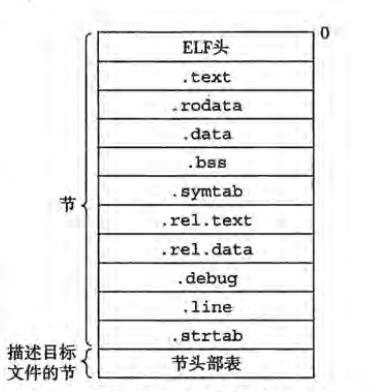
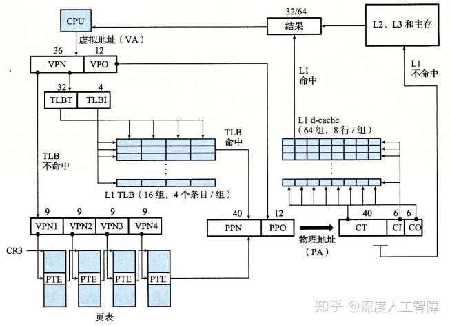

# 目录
<!-- vim-markdown-toc GFM -->

- [链接](#链接)
  - [静态链接](#静态链接)
  - [动态链接](#动态链接)
  - [链接问题](#链接问题)
  - [库打桩](#库打桩)
- [异常控制流](#异常控制流)
- [虚拟内存](#虚拟内存)

<!-- vim-markdown-toc -->

# 链接
&emsp;链接(linking)时将各种代码和数据片段收集并组合成为一个单一的文件的过程，这个文件可以被加载(复制)到内存并执行。
链接可以执行于编译时(compile-time)，称为静态链接；也可以执行于加载时(load-time)和运行时(run-time)，统称为动态链接。

&emsp;链接一般有链接器执行，它使分离编译(separate compile)成为可能，我们不用一个大型程序的源码全都写在一个源文件里，
而是可以分散在不同的文件，通过将项目分解为一个个更小的、更便于管理的、解耦的模块。
我们可以独立的修改其中个别模块，完成后只需要重新编译修改过的模块，然后与其他之前就编译过的模块链接到一起，
从而使生产更方便、高效。

&emsp;在C/C++中，编写大型程序时，通常会将源码分解到多个`*.c`文件中，称为**实现文件**。
在众多`*.c`文件中，必须有且仅有一个文件包含main函数作为整个程序的执行入口，我们可特别地称之为**main文件**。
各个实现文件文件之间通过头文件(`*.h`)从逻辑上联系在一起，这些头文件又称为**接口文件**。
接口文件中定义了各个函数、全局变量等等的接口（或称为使用方法），而实现文件负责编写这些函数来实现这些功能。


&emsp;C/C++的“编译”可细分为4步：
> 编译更具上下文语境，可以广泛地指这四步之和，也可仅指编译这一步
* 预编译：将所有`#`开头的预处理指令进行扩展，如`#include`、`#define`、`#if`等，形成新的源文件

* 编译：最为复杂的一步，编译器需要将C/C++的源码编译为汇编源码，这其中需要各种语法解析与逻辑优化等

* 汇编：将汇编源码翻译为二进制的机器指令序列，并将这些执行指令与一些其他信息封装到文件中，被称为“可重定位目标文件”

* 链接：将汇编步骤中产出的“可重定位目标文件”链接(重新组织)到一个文件中，而最后这个文件就是“可执行目标文件”，
也就是我们俗称的“应用程序”。

可重定位目标文件在linux命名格式为`*.o`，在Windows上为`*.obj`。
linux静态库`lib*.a`，Windows静态库`*.lib`。
linux动态库`lib*.so`，Windows动态库`*.dll`
linux可执行目标文件`*`，Windows可执行目标文件`*.exe`

gcc相关的参数如下
* gcc
    * 指定输出文件          ：-o
    * 优化级别              ：-O0 -O1 -O2 -O3 -Ofast -Os -Og
    * 使用AVX2指令          ：-mavx2
    * 编译程度              ：-E  -S  -c
        > cpp.i ccl.s as.o
    * 指定标准              ：-std=c11
    * 宏开关                ：-Dmacro=defin -Umacro
    * 指定头文件            ：-Idir
    * 指定程序库            ：-Ldir  -lxxx（库名libxxx.a、libxxx.so）
    * 指定字长              ：-m32 -m64
    * 指定程序规模          ：-mcmodel=large
        > 默认32位地址用于相对跳转，即代码段与数据段不能超过4GB
    * 全静态链接            ：-static
    * 制作动态库            ：-shared -fpic
    * 调用链接器            ：-ldl -rdynamic
    * 链接库打桩            ：-Wl,--wrap,func
    * GPROF剖析             ：-pg -Og -g3 -fno-inline
    * 调试                  ：-Og -g3 -fno-inline
    * 开启C++标准库debug模式：-D_GLIBCXX_DEBUG -D_GLIBCXX_DEBUG_PEDANTIC

## 静态链接

在Linux中，目标文件（汇编或链接步骤的结果文件）的格式为ELF。
下图为可重定位目标文件。



| Section              | 描述                                                                                                                                                     |
|----------------------|----------------------------------------------------------------------------------------------------------------------------------------------------------|
| .text                | 代码段，编译而成的机器代码序列就被组织在这儿                                                                                                             |
| .rodata              | 只读数据段，里面保存着仅用于机器代码本身使用的只读数据，如switch语句的跳转表、字符串字面值`"c-string"`、浮点数字面值（浮点指令不支持立即数）等等         |
| .data                | 数据段，存储静态生命周期的变量，如全局变量、static变量等等                                                                                               |
| .bbs                 | 为节省空间，未显式初始化的静态生命周期的变量默认初始化为0，这些数据则只记录在符号表中而不在目标文件中存储它们的值。在加载时，才为它们分配空间并初始化为0 |
| .symtab              | 符号表，该目标文件引用的符号的信息。此处**符号**即指函数、全局变量等可以在多个文件间共享、联系的对象。                                                   |
| .rel.text与.rel.data | 包含了重定位信息，如该可重定位目标文件中有哪些位置的地址数据需要在重定位时修改                                                                           |
| .debug               | 调试符号表，用于调试的信息，如局部变量和类型定义等等                                                                                                     |
| .line                | C/C++源代码行号与.text中代码之间的映射，也属于调试信息                                                                                                   |
| .strtab              | 包含了ELF文件中所有需要的字符串元信息，如.symtab与.debug都有存有一个.strtab的偏移量表示字符串，用于标识函数名、变量名等                                  |
<br>

* * * * * * * * * *

**符号解析**

&emsp;符号解析是链接过程的第一步。目的是将各个文件中对一个符号的引用与一个符号的定义联系起来。
这样，我们在main.c中引用外部符号时，链接器就可以帮我们从一堆文件中唯一确定一个符号给main.c使用。

&emsp;注意，链接器使用的符号的名字与我们C/C++源文件中的名称很可能是不同的，道理很简单，
我们可以在不同的函数中定义同名的static变量，若.strtab中记录的名字与源码中一样那必定会引起冲突。
汇编器使用了一种叫**符号重整**的技术，将同一个文件中的不同符号映射到唯一的一个字符串上，且过程可逆。（双射函数）


&emsp;将一系列可重定位目标文件装到一起就是**静态库**（至于动态库后面再讲），
这样一来就可以很方便的链接静态库中的可重定位目标文件，
而不用想以前那样给编译器一堆的目标文件作为参数。

&emsp;在进行符号解析时，一般流程如下：
> 注意，若引用的符号在本文件中就有定义，则简单的链接到这个符号即可，故符号解析主要是针对与外部符号的引用
1. 链接器维护3个集合，E链接文件、U未定义符号、D已定义符号
2. 按编译器参数顺序来解析目标文件和库，若为目标文件则将其加入E
3. 首先找出未定义符号并加入U，在找出已定义符号加入D
4. 若当前文件的已定义符号可对应一个未定义符号，则将该未定义符号从U中删除，并创建二者链接关系。
若该文件为库中一个成员，则将该成员加入E

5. 最后，E中成员即是抽取出的需要进入下一步链接的文件；
U中成员即是未解析成功的符号，报错并掏出；
D中成员即是所有已定义符号，利用这个集合来将所有外部符号引用链接到一个符号定义，
除此之外还可用于检查是否有符号定义冲突。

> 注意，在静态库内部的依赖关系会由工具链自动解决，即libe.a中有a.o依赖于b.o，
> 当抽取出a.o时也同时会抽取出b.o。

* * * * * * * * * *

**重定位**

&emsp;符号解析成功完成后，每个符号引用都与一个符号定义联系在了一起。
接下来要将各个文件合成一个文件，即是将多个文件的section聚合在一个文件中对应的section中。
由此产生的影响是，**各个符号的地址变动了**。

&emsp;回忆以下在[汇编语言](asm.md)所讲，当我们`jmp`或`call`时，可以使用绝对地址与相对地址。

&emsp;对于全局变量的引用，无论是绝对地址还是相对地址，聚合后都可能会改变，因为.text、.rodata、.data段的大小都可能改变。

&emsp;对于`jmp`（分支跳转或循环跳转），若是使用相对地址那是无需变动的，毕竟最然各个文件的代码段聚合在了一起，但是原本的代码段是不会被分拆的，
所以相对地址不变。

&emsp;对于`call`（函数调用），若是引用原本文件内部的函数，则无论是相对跳转还是绝对跳转都无需变动。
相对跳转的原理与`jmp`一样，但对于绝对跳转，我们需要知道编译器如何获取**绝对地址**。
当我们获取一个函数指针时，编译器会产生这样的汇编代码`leaq 0x40(%rip),%rax`，
也就是说，函数绝对地址的获取是在运行时才进行的而非编译时就写死在了代码段中。
运行时，利用PC寄存器的值（%rip）以及函数相对下条指令的地址（0x40）来获取函数的绝对地址，
所以本质上也是相对寻址，而我们原本的代码段并未被拆分，所以里面的各个函数的起始代码的相对地址也没有改变。

&emsp;但是对于外部函数的引用，那必定是会随着文件聚合而改变的。

&emsp;综上，所有引用全局变量和外部函数的地方，都需要将引用地址修改成聚合后的新地址，此过程称为**重定位**。
而这些需要修改的位置信息就记录在.rel.data与.rel.text中。

## 动态链接
下图是可执行目标文件的格式内容。
相对可重定位目标文件，它少了用于重定位的.rel.text与.rel.data


| section | 描述                                                       |
|---------|------------------------------------------------------------|
| ELF头部 | 描述文件的总体格式，还包括程序入口点，一般为_start函数地址 |
| .init   | 定义了一个小函数叫`_init`用于程序的初始化                  |


&emsp;如上图所述，当我们执行程序时，ELF中的前一部分加载到代码段，
中部分加载到数据段，后一部分不加载。
同一段中的地址连续。虽然图中并未呈现出来，但我们需要知道每个段不是连续的，
一般都有间隔，并且需要对齐。注意，该间隔在编译期即可确定而非运行期，所以相对地址仍然有效。

&emsp;在Linux x86-64系统中，代码段总是从地址0x400000处开始，
而运行时栈从最大合法用户地址($2^{48}-1$)开始向下生长。
而从$2^{48}$开始是为内核中的代码和数据保留的，所谓**内核**就是操作系统常驻内存的部分。

&emsp;而本节的主角——动态库，就被运行时加载到内存中部。动态库就是一种在运行时才进行链接的程序库，
该链接又被称作动态链接。动态链接的优点便是当我们修改一个模块时，不再需要重新链接出可执行文件然后再发布出去了，
而是只需重新编译动态模块，然后只发布这个动态模块，更新非常方便，甚至可在程序正在运行的时候就更新程序。
动态库的全称为“动态共享库”，也就是它可以被多个运行中的程序同时使用，不像静态库那样各个程序都有一份拷贝而浪费空间。
注意，此处共享的仅仅时代码段，而数据段在每个程序中都有副本（该数据段副本需要保证与共享代码段的相对位置与原来一样）。

&emsp;动态链接中的**符号解析**与静态链接同理，且都是在编译期就完成，而**重定位**需要在运行时完成，

&emsp;首先我们的研究对象时动态库。
回忆之前所述绝对地址与相对地址，我们可以保证共享代码段与数据段副本的相对位置不变，
所以我们无需对动态库的内部引用进行重定位。而当动态库依赖其他动态库时，与我们的执行文件依赖动态库的情况是一样的，
所以接下来统一讲授如何解决引用动态库时的符号重定位问题。

&emsp;首先强调，动态链接不时使用“聚合”这个手段，
而是引入GOT(全局偏移量表)与PLT(过程链接表)，它们在编译期就存储在数据段开始处。
我们给出的抽象时，GOT存储动态库全局变量的绝对地址，PLT存储动态库函数的绝对地址，
它们的绝对地址由链接器来保证。

于是乎，对于整个动态链接的过程描述如下：
1. 编译时，仅会从动态库中复制一些符号表信息与重定位信息到可执行文件中。

2. 加载(执行)程序时，加载器注意到执行文件需要动态链接。于是去加载需要的未加载的共享库，
然后把共享库的代码段和数据段映射到某内存段。同时在加载时重定位执行程序对动态库中全局变量的引用，
即修改GOT表

3. 当引用动态库代码时，从PLT中获取函数地址并调用。初始时，PLT地址并非动态库函数地址，
而是本地的一段代码，这段代码的作用是到去该PLT项对应的一个GOT项查看是否存放有函数地址，
若没有则调用链接器重定位之，然后将地址放入该PLT项。目的是为了过程调用延迟绑定，以缩短加载时间。

4. 当第一次执行动态库中的指令时，才会从硬盘中加载代码数据到内存，也就是延迟加载技术。

## 链接问题
&emsp;在链接中存在着令人头疼的问题：
* 链接器无法找出某个模块中所引用的符号。出现这个错误可能有以下几种原因：
    * 你™`#include`写没写。没有声明就想直接用？

    * 如果使用的符号在默认的库中，检查你编译套件的安装有没有问题

    * 如果不是在默认库中，那检查有没有把库的路径作参数传给编译器

    * 还有，符号解析一般是按照给编译器参数的顺序来的。
    如果你把依赖库放在参数的前面，抽取出库中某些成员后就不再使用它了，
    若后面的模块需要的符号在前面的库中的其他成员中定义，那也没办法了，只有报错了。
    所以注意把依赖库放在参数后面，并且出现库的循环依赖时有必要出现多次

* 多次定义同名符号。在C/C++中，全局符号由如下几种使用方法：
    * `int I;`，定义强符号，默认初始化为0
    * `int II = 1;`，定义强符号并显式初始化
    * `extern int EI;`，定义弱符号
    * `extern int EII = 1;`，定义强符号并显式初始化

    多次定义同名的强符号会导致符号解析冲突而链接出错，但是允许定义多个同名的弱符号和最多一个强符号，
    此时所有对弱符号的引用的就会链接到强符号上。若没有强符号则弱符号全都链接到初始值为0的（新创建的）符号上。

    特别的，在C/C++存在inline语义，允许多个文件中定义同名符号，并所有对该符号的引用链接到其中一个inline定义上
    （一般来说选择编译器参数中顺序靠前的一个模块中的inline定义）。
    这么做的目的就是为了能在头文件（接口文件）中定义符号，而有不至于造成多次定义同名符号的错误
    （所有`#include`该头文件的实现文件均会存在该符号的inline定义）

* 正如上条所说，对弱符号的引用可能会链接到强符号上，所以当我们不想如此时一定要初始化我们的全局变量。

* 目标文件一般时不包含符号的类型信息的，所以可能导致引用和定义的符号的语言级类型不同。
比如你试图引用一个外部符号`extern int I;`，但是符号定义为`float I=1.0`，很明显会形成逻辑错误，
但也仅仅是逻辑错误，语法上时没问题的，链接器并不会为我们报错。

## 库打桩
打桩的目的是更改程序原本的符号引用，改为我们希望它引用的新符号。

**编译时打桩**：
源码都有了，随便咋折腾

**链接时打桩**：
让链接器转而链接的我们编写的符号

```sh
gcc -Wl,--wrap,original -o a.out 需要更改链接的目标文件.o 我们编写的目标文件.o
 # 如此一来，所有引用original符号的都链接到__wrap_original的定义
 # 而所有引用__real_original的符号链接到original的定义
```
**运行时打桩**：让我们的动态库先于原库被搜索
> [转载自CSDN](https://blog.csdn.net/fan_hai_ping/article/details/6763733)

Linux下搜索动态库路径的次序：
1. ELF可执行文件中动态段中DT_RPATH所指定的路径
2. 编译目标代码时指定的动态库搜索路径（-WI,-rpath=./）；
3. 环境变量LD_LIBRARY_PATH指定的动态库搜索路径；
4. 配置文件/etc/ld.so.conf（或ld.so.cache）中指定的动态库搜索路径；
5. 默认的动态库搜索路径/lib；
6. 默认的动态库搜索路径/usr/lib。

在上述1-3中指定的动态库搜索路径都可以指定多个搜索目录，其先后顺序是按指定路径的先后顺序搜索的。如果动态库之间存在依赖关系，那么先加载那些被依赖的动态库。

Windows下搜索动态库路径次序：
1. 可执行文件所在的目录（当前目录）；
2. Windows的系统目录（该目录可以通过GetSystemDirectory函数获得）；
3. 16位的系统目录（Windows目录下的system子目录）；
4. Windows目录（该目录可以通过GetWindowsDirectory函数获得）；
5. 进程当前所在的工作目录；
6. PATH环境变量中所列出的目录。


# 异常控制流
&emsp;一个CPU只能运行程序，而操作系统想要获取外部事件的发生（网络包到达、键盘输入等）并处理之，
就需要CPU提供几个机制能够打断当前正在运行的程序转而处理该外部事件，该机制叫做“异常”。
而控制流的突变转移就叫ECF(异常控制流)。

**异常类型**
* 中断  ：来自外设的I/O信号，返回下条指令
    > 如键盘的输入、网络数据包的到达、硬盘的读取、时钟滴答等等。
    > 中断作为一种特殊的异常，它的发生在用户态程序往往是不可见的，即不改变进程抽象模型。
* 陷入  ：程序指令的有意结果，返回下条指令
    > 最重要的用途便是进行系统调用`syscall`
* 故障  ：若能修正则返回当前指令，否则终止程序
    > 如整数除零、段错误等
* 终止  ：不可回复的致命错误，直接终止程序
    > 一般由一般硬件错误引发

操作系统给出的进程抽象模型是
* 进程占用连续的内存（虚拟内存）
* 进程拥有连续不断的逻辑流（上下文切换）

&emsp;在系统启动时，操作系统分配并初始化一张称为异常表的跳转表（回忆switch语句的汇编代码），
使得第k条目包含异常k的处理程序的地址。异常表的起始地址放在一个叫*异常表基址寄存器*中。
异常类似过程调用，但处理器会负责将额外的寄存器信息压入内核栈，并时处理器进入内核模式。

&emsp;处理器中存在一控制寄存器中的一个模式位来标识处理器是处于用户模式还是内核模式。
在内核模式，处理器可以执行指令集中所有指令，并能访问内存中所有位置。
而从用户模式进入内核模式的途径只有“异常”，这样的机制为操作系统内核提供了一个无懈可击的进程模型。

&emsp;进程就是运行中的程序实例。一个系统中同时运行着许多进程，利用时分复用技术实现上下文切换，
使多个进程看上去正同时运行在一个处理器上，但其实是它们在不断快速切换。
进程切换由操作系统执行，而选择哪个进程来占用CPU的过程称为调度(schedule)。

&emsp;而调用的实现也需要“异常”，通常没过1ms或10ms时钟滴答一次，引起CPU上一个引脚产生电平发生变化。
CPU判断出该信号为异常(中断)，然后用异常号作索引从异常表中获取处理程序地址。
在执行处理程序前，先将寄存器信息压入内核栈，然后执行该处理程序——调度程序。
操作系统根据系统信息，利用多级优先队列实现调度算法得出下个时间片该是哪个进程，
然后将之前进程的上下文保存起来，再将下个进程的上下文恢复，然后控制流转移到执行下个进程。
至此，一个调度周期完成。

&emsp;在linux上，调度其实以线程为基本单位，同属一个进程的线程可以共享许多信息（如虚拟内存），
但每个线程又有自己独立的信息，特别是，每个线程有自己独立的控制流。
在多核处理器上，操作系统通常会尽量将同一进程的不同线程安排在不同的核上，
以让进程利用充分利用多核处理器的性能，同时更重要的，为进程提供了异步机制。

&emsp;当逻辑流按顺序一步一步执行时，被称为同步，同步逻辑流中，下一个逻辑的执行会等待上一个逻辑执行完成后才开始；
当下一个逻辑不再等待而直接执行时，被称为异步。
异步机制可以使我们的程序同时执行多项任务，而异步机制的实现就需要并发机制！

&emsp;系统上多个进程同时运行叫做并发，进程中多个线程同时执行也叫并发。
在多核处理器上，利用多个核心同时运行程序，叫做并行并发。
而利用时分复用技术来快速切换逻辑流则被称为串行并发。


# 虚拟内存
&emsp;虚拟内存给进程提供了一个非常优秀的抽象，即对进程来说似乎所有内存都是进程自己的。
其实只是所有$2^{48}$个(用户态)地址空间都是你自己的，进程使用的地址实际上不是真正的内存地址。
操作系统配合CPU来一起将这些虚拟空间地址翻译成实际的内存地址（当然也可能在硬盘上），
通过虚拟内存模型，可以获得诸多好处：
* 通过虚拟空间地址，进程可以访问内存以及硬盘
    > 当然不是全部的硬盘，而是内存放不下的那些数据而被遣返到了低速的硬盘上了，linux上管这叫swap空间
* 所有地址空间都属于进程自己的，可以大大简化内存管理
    > 地址连续的虚拟内存实际上可能分散在物理内存各处，甚至在硬盘上
    * 简化链接
    * 简化加载
    * 简化共享
    * 简化内存分配
* 保护每个进程的地址空间独立
    > 这样不同的进程一般就看不见其他进程的数据，甚至若不使用系统调用，进程都会以为自己时处理器上唯一运行的程序。


&emsp;CPU中专门翻译虚拟地址的硬件叫内存管理单元(MMU)，会利用到操作系统管理的内存分配信息。
该信息存储在每个进程的进程控制块中。

&emsp;想一字节一字节将虚拟地址映射到物理地址显然需要太多内存，于是将内存以“页”为单位进行分割，
一页一般有4K大小。操作系统为每个进程维护一张页表，记录分配给进程的页的信息。
虚拟地址并不是都可以直接引用的，只有操作系统以页为单位分配给了进程后才能引用，
否则无法翻译地址而出现一般保护故障，俗称“段错误”。

&emsp;CPU中个控制寄存器叫页表基址寄存器(PTBR)，存储当前的页表的基址。
在MMU中包括了一个关于PTE(页表表项)的小的高速缓存，称为翻译后背缓冲器(TLB)，
其结构类似CPU高速缓存中的相联组。
而翻译过程页类似高速缓存类似，将地址分割为多段再到页表中去匹配，而TLB便可以缓存内存中的页表，
缓存不命中也由TLB解决。
地址分割为多段后，页表也可分为多级，若高级页表为空，则页无需为其低级页表分配空间了。



1. CPU产生一个虚拟地址
2. MMU从TLB中取出虚拟地址对应的PTE
3. MMU翻译出物理地址，并发送给高速缓存

> 翻译优化：CPU将VPN发送给MMU并同时发送VPO给高速缓存，因为VPO与PPO时相同的，
> 所以可以将VPO直接分解为高速缓存的组号与块偏移量，当MMU翻译出PPN时，
> 高速缓存已经准备好将提前读取的一个缓存组中各行的标识位与PPN进行匹配。

&emsp;Linux将虚拟内存组织成一些区域（也叫段）的集合。
一个段就是已分配的虚拟内存的连续的页，这些页以某种方式相关联。（如代码段、数据段、堆段、共享代码段、栈段）。
而操作系统也会为每个进程维护一张段表来记录其段信息。
段表的作用还包括区分缺页异常的真正原因：
* 若该虚拟地址不存在于任何段的地址范围中，则表示这是一次段错误
* 若对目标页面进行非法操作也会引发缺页异常，通过段表中的权限信息可分辨
* 若上述两个判断都通过，则说明为正常缺页。通过高速缓存类似的驱逐策略来加载页面。

除了这些，段表还可以用来实现写时复制和延迟加载机制

**堆内存管理**：分配与垃圾回收

*堆块格式*  


*类大小空闲块链表数组*  


难题：
* 快速分配
* 碎片整理
* 垃圾回收


更多操作系统相关知识见
[Linux知识框架](linux.md)
与
[Linux系统接口](apue.md)

<!--
链接：
    静态链接、静态库、符号解析、重定位、相对/绝对地址
    动态链接、动态共享库、重定位、GOT、PLT
    链接问题：无法解析、多重定义、类型错误、错误弱引用
    库打桩：链接时、运行时
异常：
    中断、陷入、故障、终止
    异常表、内核模式
    上下文切换、进程/线程调用、同步/异步、并行串/行并发
虚拟内存：
    页、页表、段、段表
    MMU、TLB、多级页表、VPN与VPO并行优化
    缺页、段错误、保护异常、写时复制、按序加载、内存映射
    内存分配与回收管理
-->
