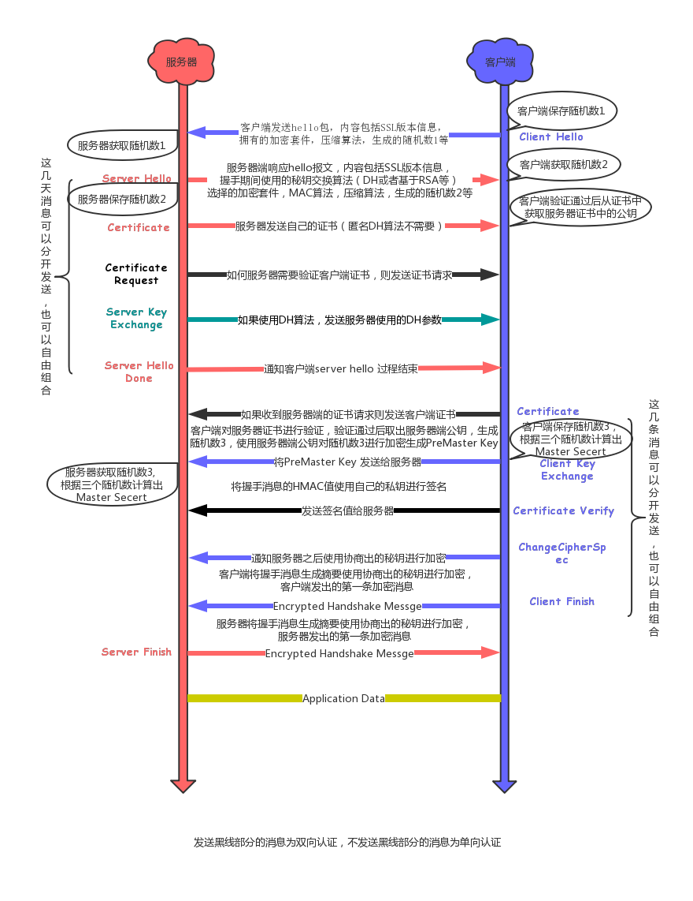

# 目录
<!-- vim-markdown-toc GFM -->

- [差错校验技术](#差错校验技术)
- [加密技术](#加密技术)
  - [散列算法](#散列算法)
  - [对称加密技术](#对称加密技术)
  - [非对称加密技术](#非对称加密技术)
  - [数字证书](#数字证书)
  - [数字签名](#数字签名)
  - [安全隧道](#安全隧道)
- [关于OpenSSL](#关于openssl)

<!-- vim-markdown-toc -->

# 差错校验技术
* （二维）奇偶校验
    > 通过附加检验比特位来使行（列）中1的个数为奇数，
    > 一维奇偶校验无法检验偶数个比特差错，
    > 二维奇偶校验不但可以检验、定位并矫正单个比特差错，还可以检验任意两个组合的比特差错

* 检验和方法（TCP与UDP）
    > 将数据分为一个个int16_t并回卷求和，再求反码，即为检验和。
    > 检验时将所有数据（包括检验和）分为一个个int16_t并求和，所得应为数位全1

* CRC（循环冗余检测）
    > 链路层

# 加密技术
## 散列算法
也可称作hash算法、信息摘要算法、不可逆加密技术  
[更多介绍](https://zhuanlan.zhihu.com/p/101390996)

* 原理：
    * 将给定的内容(不限字节大小)转换成一串固定字节大小的数值(称作hash值)，而该hash值串就作为给定内容的**指纹**，
        意思是你可以“完全”用该短小的hash值串代表给定的内容。
    * 换句话说，如果有两个文件A和B，他俩用同一个hash算法算出来的hash值是一样的，则可以认为这俩文件的内容完全一样。
        否则，即使他俩只有一个Byte的差别，得出的两个hash值也天差地别

* 性质：
    * 抗碰撞性：尽量避免冲突
    * 抗篡改性：只要改动一个字节得到的hash值也有很大不同
    * 查找效率：生成hash值的速度
    * 不可逆性：不可由hash值推出原文

* 作用：
    * 身份验证
        > 服务器存储明文密码的hash值，即使泄漏也无法得到密码；
        > 而用户登录验证时传递明文密码给服务器，服务器hash后于存储值比较
    * 完整性校验
        > 将明文m与hash(m, MAC)连接发送，对等端校验hash(m, MAC)是否匹配，防止中间人攻击；
        > 非对称加密开销过大，不能用其来验证每条消息的完整性
    * 计算文本摘要（信息指纹）
    * hash表数据结构

## 对称加密技术
* 原理：
    * 通讯双方在通讯之前就约定一个加密密码(一个**数值**)，然后双方的通讯内容都用该密码加密
    * 加密方法就是，将**数值**和**明文通讯内容**作为参数传给一个加密算法，即可得到加密密文
    * 解密方法就是，将**数值**和**密文通讯内容**作为参数传给对应的解密算法，即可解密出原来的明文

* 性质：
    * 对称加密技术是可以解密的，和上面的hash不同
    * 需要双方提前知道加密密码于加密算法

* 作用：
    * 文件加密
        > 将机密文件“上锁”，钥匙存脑子里:smile:是不是很有意思。
        > 利用区块链技术，你会发现脑子还可以存你全身家当，轻装跑路不是梦🙈️
    * 通讯加密
        > 双方的通讯约定使用同一种对称加密算法和统一密码加密，则只有双方可读。  
        > 通讯加密只是一种特殊的文件加密

## 非对称加密技术
* 原理：
    * 私钥可以算出公钥，反之公钥无法算出私钥
    * 私钥加密需公钥解密，公钥加密需私钥解密

* 作用：
    * 通讯加密
        > 用对方的公钥加密，则只有对方(拥有对应私钥)能解密
    * 身份验证
        > 数字证书与数字签名，见下

## 数字证书
* 作用：确认访问的网站是相对安全的，它是经过权威的认证中心(**CA**)认证过身份的
* 原理：
    * CA发放证书，证书由CA的私钥加密，若由对应CA的公钥解密出正确信息即可确认证书不假
        > 由CA负责保证其私钥不会泄漏，从而杜绝伪造证书  
        > 注意上面说的是**证书不假**，证书是不是对方的还得继续往下看
    * 证书内容：
        * 版本
        * 签名算法（哈希算法与非对称加密算法）
        * 证书有效期
        * 使用者信息（国家、地区、组织、名字/域名）
        * 使用者公钥
            > 非常重要的信息，这就是用来确认上面说的——对方是否为证书的主人
        * 颁发者信息（颁发者的网站与证书等）
        * 等等。。。
        * 颁发者利用其私钥对该证书的签名
            > 此处的密文即由上面全部明文hash后再用CA的私钥加密得到。
            > 浏览器会将全部明文同样进行hash得到串**S1**，再用CA的公钥解密该密文得到串**S2**，若**S1**等于**S2**则说明证书是真的。  
            > 用反证法可以证明：若证书为假(即密文并非由CA的私钥加密)，我们用CA的公钥解密出的**S2**
            > 应该是“乱码”(与**S1**碰撞的可能性极低)，而该“乱码”有与明文hash值相同，这违背了非对称加密技术的性质——私钥加密只有公钥能解密。
            > 故得证，证书为真

**注意**：并不是对所有CA都是无条件信任的，验证一个网站的证书，还需验证其颁发者的证书，
一直向上追溯直到需要验证Root CA时才无条件信任。

## 数字签名
* 作用：确认消息的发送者确实是其附上公钥的主人
* 原理：
    * 首先，类似数字证书——将明文信息hash后用私钥加密，随明文一起发送，  
        明文的内容包括：
        * 发送方公钥
        * 正文信息(如发起的交易的信息)
    * 接收方用发送方公钥解密密文部分，在与明文hash后对比，若匹配则说明发送方确实是正文信息的主人

> 数字签名与数字证书的验证，都需要一个信任的源头，数字签名即信任签名的公钥，数字证书即信任Root CA

## 安全隧道
首先是SSL/TLS协议：
* 作用：客户端与服务器建立一个只有双方才能解密会话内容的加密通讯隧道
* 流程：
    * 客户端(**C**)发起连接请求，内容包括：协议版本、支持的加密算法等

    * 服务器(**S**)回传包括：协议版本、选择的加密算法、数字证书等

    * 如果证书验证通过(即对网站服务器的身份验证)，
        客户端会生成一个随机数，正式的安全隧道通信会使用对称加密，
        而该随机数值即作为对称加密的密码，然后发送握手消息，其中包括：
        1. 对称密码的密文(用证书上的公钥加密)
        2. 握手消息的密文(用上面的对称密码加密)
        3. 握手消息的hash值
        > 接下来，对客户端来说还需要确认的有：
        > * 对方(服务器)是证书的主人
        > * 对方已接收到正确的对称密码

    * 服务器接受消息后：
        1. 用**自己的私钥**解密出对称密码(若能正确执行此步骤，则该服务器确实是证书的主人)
        2. 并用该对称密码解密出握手消息
        3. 上一步解密出的握手消息hash后与接收到的握手消息hash值对比，确认密码可行性
        4. 回传包括：
            * 重新生成的握手信息的密文(用对称密码加密)
            * 重新生成的握手信息的hash值

    * 客户端接收回传信息：
        1. 解密握手信息，hash后对比接收的hash值
        2. 若相同，则证明了之前待确认信息
        3. 接下来的安全隧道即用该对称密码加密

SSH协议与此不同，因为HTTPS是用于网站访问的加密：服务器是开放的，客户端是陌生的  
而SSH协议是有**用户**这个概念的，若客户端不是服务器的注册用户则不可访问，
故连接过程需要验证用户身份，或者通过用户密码(散列算法)，或者用用户的私钥(非对称加密)，验证细节不再赘述

# 关于OpenSSL

* x509证书链
    * .key：密钥
        > `openssl genrsa -des3 -out server.key 2048`
    * .crt：证书文件，由CA的私钥签名
        > Windows下也叫.cer
    * .pem：封装了crt与key（也可能只有其一）
    * .csr：证书请求文件，需要用自己的私钥签名
        > `openssl req -new -key server.key -out server.csr`  
        > 依次输入国家、地区、组织、email、common name（名字或域名）

关于[Diffie Hellman](https://wiki.openssl.org/index.php/Diffie_Hellman)
> The Diffie-Hellman algorithm provides the capability for two communicating parties to agree upon a shared secret between them. Its an agreement scheme because both parties add material used to derive the key (as opposed to transport, where one party selects the key). The shared secret can then be used as the basis for some encryption key to be used for further communication.
>
> If Alice and Bob wish to communicate with each other, they first agree between them a large prime number p, and a generator (or base) g (where 0 < g < p).
> 
> Alice chooses a secret integer a (her private key) and then calculates ga mod p (which is her public key). Bob chooses his private key b, and calculates his public key in the same way.
> 
> Alice and Bob then send each other their public keys. Alice now knows a and Bob's public key gb mod p. She is not able to calculate the value b from Bob's public key as this is a hard mathematical problem (known as the discrete logarithm problem). She can however calculate (gb)a mod p = gab mod p.
> 
> Bob knows b and ga, so he can calculate (ga)b mod p = gab mod p. Therefore both Alice and Bob know a shared secret gab mod p. Eve who was listening in on the communication knows p, g, Alice's public key (ga mod p) and Bob's public key (gb mod p). She is unable to calculate the shared secret from these values.
> 
> In static-static mode both Alice and Bob retain their private/public keys over multiple communications. Therefore the resulting shared secret will be the same every time. In ephemeral-static mode one party will generate a new private/public key every time, thus a new shared secret will be generated.
>
> Anonymous Diffie-Hellman uses Diffie-Hellman, but without authentication. Because the keys used in the exchange are not authenticated, the protocol is susceptible to Man-in-the-Middle attacks. Note: if you use this scheme, a call to SSL_get_peer_certificate will return NULL because you have selected an anonymous protocol. This is the only time SSL_get_peer_certificate is allowed to return NULL under normal circumstances.
> 
> You should not use Anonymous Diffie-Hellman. You can prohibit its use in your code by using "!ADH" in your call to SSL_set_cipher_list.
> 
> Fixed Diffie-Hellman embeds the server's public parameter in the certificate, and the CA then signs the certificate. That is, the certificate contains the Diffie-Hellman public-key parameters, and those parameters never change.
> 
> Ephemeral Diffie-Hellman uses temporary, public keys. Each instance or run of the protocol uses a different public key. The authenticity of the server's temporary key can be verified by checking the signature on the key. Because the public keys are temporary, a compromise of the server's long term signing key does not jeopardize the privacy of past sessions. This is known as Perfect Forward Secrecy (PFS).
> 
> You should always use Ephemeral Diffie-Hellman because it provides PFS. You can specify ephemeral methods by providing "kEECDH:kEDH" in your call to SSL_set_cipher_list.

> 如果双方有一个对称加密方案，希望加密通信，而且不能让别人得到钥匙，那么可以使用 Diffie-Hellman 算法交换密钥。

> 如果你希望任何人都可以对信息加密，而只有你能够解密，那么就使用 RSA 非对称加密算法，公布公钥。

更多相关信息[见](https://www.jianshu.com/p/fcd0572c4765)
